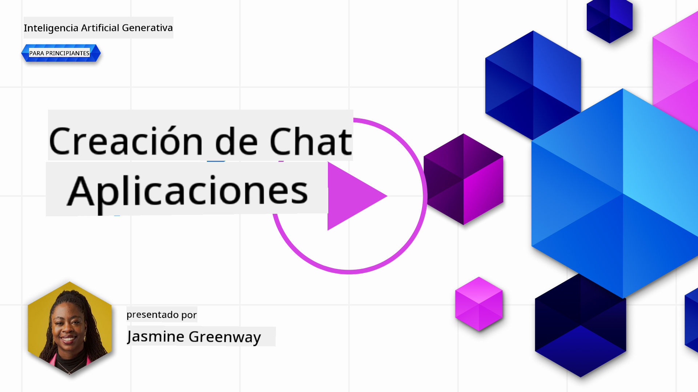
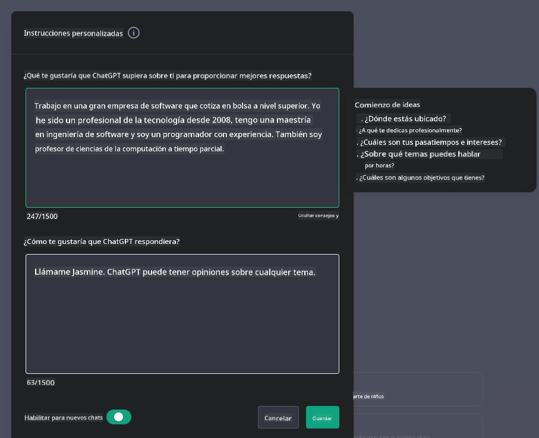
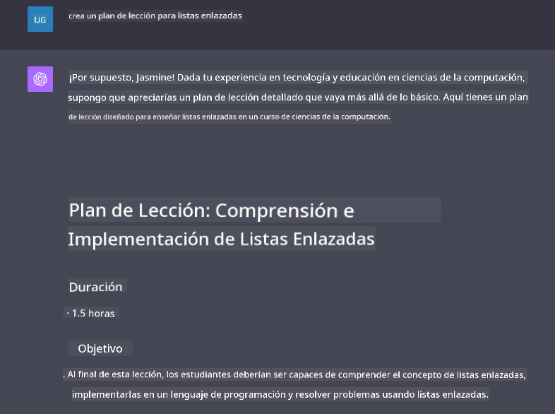

<!--
CO_OP_TRANSLATOR_METADATA:
{
  "original_hash": "ea4bbe640847aafbbba14dae4625e9af",
  "translation_date": "2025-05-19T10:08:47+00:00",
  "source_file": "07-building-chat-applications/README.md",
  "language_code": "es"
}
-->
# Construyendo Aplicaciones de Chat Impulsadas por IA Generativa

[](https://aka.ms/gen-ai-lessons7-gh?WT.mc_id=academic-105485-koreyst)

> _(Haz clic en la imagen de arriba para ver el video de esta lección)_

Ahora que hemos visto cómo podemos construir aplicaciones de generación de texto, veamos las aplicaciones de chat.

Las aplicaciones de chat se han integrado en nuestra vida diaria, ofreciendo más que solo un medio de conversación casual. Son partes integrales del servicio al cliente, soporte técnico e incluso sistemas de asesoría sofisticados. Es probable que hayas recibido ayuda de una aplicación de chat no hace mucho tiempo. A medida que integramos tecnologías más avanzadas como la IA generativa en estas plataformas, la complejidad aumenta y también los desafíos.

Algunas preguntas que necesitamos responder son:

- **Construcción de la aplicación**. ¿Cómo construimos e integramos de manera eficiente estas aplicaciones impulsadas por IA para casos de uso específicos?
- **Monitoreo**. Una vez desplegadas, ¿cómo podemos monitorear y asegurar que las aplicaciones operen al más alto nivel de calidad, tanto en términos de funcionalidad como de adherencia a los [seis principios de IA responsable](https://www.microsoft.com/ai/responsible-ai?WT.mc_id=academic-105485-koreyst)?

A medida que avanzamos hacia una era definida por la automatización e interacciones sin fisuras entre humanos y máquinas, comprender cómo la IA generativa transforma el alcance, la profundidad y la adaptabilidad de las aplicaciones de chat se vuelve esencial. Esta lección investigará los aspectos de la arquitectura que soportan estos sistemas complejos, profundizará en las metodologías para ajustarlos a tareas específicas de dominio y evaluará las métricas y consideraciones pertinentes para asegurar un despliegue responsable de la IA.

## Introducción

Esta lección cubre:

- Técnicas para construir e integrar aplicaciones de chat de manera eficiente.
- Cómo aplicar personalización y ajuste fino a las aplicaciones.
- Estrategias y consideraciones para monitorear efectivamente las aplicaciones de chat.

## Objetivos de Aprendizaje

Al final de esta lección, podrás:

- Describir consideraciones para construir e integrar aplicaciones de chat en sistemas existentes.
- Personalizar aplicaciones de chat para casos de uso específicos.
- Identificar métricas clave y consideraciones para monitorear y mantener la calidad de las aplicaciones de chat impulsadas por IA.
- Asegurar que las aplicaciones de chat utilicen la IA de manera responsable.

## Integrando IA Generativa en Aplicaciones de Chat

Elevar las aplicaciones de chat a través de la IA generativa no solo se centra en hacerlas más inteligentes; se trata de optimizar su arquitectura, rendimiento e interfaz de usuario para ofrecer una experiencia de usuario de calidad. Esto implica investigar los fundamentos arquitectónicos, integraciones de API y consideraciones de interfaz de usuario. Esta sección tiene como objetivo ofrecerte una hoja de ruta integral para navegar por estos complejos paisajes, ya sea que los estés integrando en sistemas existentes o construyéndolos como plataformas independientes.

Al final de esta sección, estarás equipado con la experiencia necesaria para construir e incorporar aplicaciones de chat de manera eficiente.

### ¿Chatbot o Aplicación de Chat?

Antes de sumergirnos en la construcción de aplicaciones de chat, comparemos 'chatbots' con 'aplicaciones de chat impulsadas por IA', que cumplen roles y funcionalidades distintas. El propósito principal de un chatbot es automatizar tareas conversacionales específicas, como responder preguntas frecuentes o rastrear un paquete. Generalmente está gobernado por lógica basada en reglas o algoritmos de IA complejos. En contraste, una aplicación de chat impulsada por IA es un entorno mucho más amplio diseñado para facilitar diversas formas de comunicación digital, como chats de texto, voz y video entre usuarios humanos. Su característica definitoria es la integración de un modelo de IA generativa que simula conversaciones matizadas, similares a las humanas, generando respuestas basadas en una amplia variedad de entradas y señales contextuales. Una aplicación de chat impulsada por IA generativa puede participar en discusiones de dominio abierto, adaptarse a contextos conversacionales en evolución e incluso producir diálogos creativos o complejos.

La tabla a continuación describe las diferencias y similitudes clave para ayudarnos a comprender sus roles únicos en la comunicación digital.

| Chatbot                               | Aplicación de Chat Impulsada por IA Generativa |
| ------------------------------------- | ---------------------------------------------- |
| Enfocado en tareas y basado en reglas | Consciente del contexto                        |
| A menudo integrado en sistemas más grandes | Puede alojar uno o varios chatbots             |
| Limitado a funciones programadas      | Incorpora modelos de IA generativa             |
| Interacciones especializadas y estructuradas | Capaz de discusiones de dominio abierto       |

### Aprovechando funcionalidades preconstruidas con SDKs y APIs

Al construir una aplicación de chat, un gran primer paso es evaluar lo que ya existe. Usar SDKs y APIs para construir aplicaciones de chat es una estrategia ventajosa por varias razones. Al integrar SDKs y APIs bien documentados, estás posicionando estratégicamente tu aplicación para el éxito a largo plazo, abordando preocupaciones de escalabilidad y mantenimiento.

- **Acelera el proceso de desarrollo y reduce los gastos generales**: Confiar en funcionalidades preconstruidas en lugar del costoso proceso de construirlas tú mismo te permite centrarte en otros aspectos de tu aplicación que puedas considerar más importantes, como la lógica empresarial.
- **Mejor rendimiento**: Al construir funcionalidad desde cero, eventualmente te preguntarás "¿Cómo escala? ¿Es esta aplicación capaz de manejar un aumento repentino de usuarios?" Los SDK y APIs bien mantenidos a menudo tienen soluciones integradas para estas preocupaciones.
- **Mantenimiento más fácil**: Las actualizaciones y mejoras son más fáciles de gestionar ya que la mayoría de las APIs y SDKs simplemente requieren una actualización a una biblioteca cuando se lanza una versión más reciente.
- **Acceso a tecnología de punta**: Aprovechar modelos que han sido ajustados y entrenados en conjuntos de datos extensos proporciona a tu aplicación capacidades de lenguaje natural.

Acceder a la funcionalidad de un SDK o API generalmente implica obtener permiso para usar los servicios proporcionados, lo cual suele ser a través del uso de una clave única o token de autenticación. Usaremos la Biblioteca de Python de OpenAI para explorar cómo se ve esto. También puedes probarlo por tu cuenta en el siguiente [cuaderno para OpenAI](../../../07-building-chat-applications/python/oai-assignment.ipynb) o [cuaderno para Azure OpenAI Services](../../../07-building-chat-applications/python/aoai-assignment.ipynb) para esta lección.

```python
import os
from openai import OpenAI

API_KEY = os.getenv("OPENAI_API_KEY","")

client = OpenAI(
    api_key=API_KEY
    )

chat_completion = client.chat.completions.create(model="gpt-3.5-turbo", messages=[{"role": "user", "content": "Suggest two titles for an instructional lesson on chat applications for generative AI."}])
```

El ejemplo anterior utiliza el modelo GPT-3.5 Turbo para completar el aviso, pero nota que la clave de API se establece antes de hacerlo. Recibirías un error si no configuraras la clave.

## Experiencia de Usuario (UX)

Los principios generales de UX se aplican a las aplicaciones de chat, pero aquí hay algunas consideraciones adicionales que se vuelven particularmente importantes debido a los componentes de aprendizaje automático involucrados.

- **Mecanismo para abordar la ambigüedad**: Los modelos de IA generativa ocasionalmente generan respuestas ambiguas. Una función que permita a los usuarios pedir aclaraciones puede ser útil si se encuentran con este problema.
- **Retención de contexto**: Los modelos avanzados de IA generativa tienen la capacidad de recordar el contexto dentro de una conversación, lo que puede ser un activo necesario para la experiencia del usuario. Dar a los usuarios la capacidad de controlar y gestionar el contexto mejora la experiencia del usuario, pero introduce el riesgo de retener información sensible del usuario. Consideraciones sobre cuánto tiempo se almacena esta información, como la introducción de una política de retención, pueden equilibrar la necesidad de contexto contra la privacidad.
- **Personalización**: Con la capacidad de aprender y adaptarse, los modelos de IA ofrecen una experiencia individualizada para un usuario. Personalizar la experiencia del usuario a través de características como perfiles de usuario no solo hace que el usuario se sienta comprendido, sino que también ayuda en su búsqueda de encontrar respuestas específicas, creando una interacción más eficiente y satisfactoria.

Un ejemplo de personalización es la configuración de "Instrucciones personalizadas" en el ChatGPT de OpenAI. Te permite proporcionar información sobre ti que puede ser un contexto importante para tus avisos. Aquí hay un ejemplo de una instrucción personalizada.



Este "perfil" le pide a ChatGPT que cree un plan de lección sobre listas enlazadas. Nota que ChatGPT toma en cuenta que el usuario puede querer un plan de lección más detallado basado en su experiencia.



### Marco de Mensajes del Sistema de Microsoft para Modelos de Lenguaje Extenso

[Microsoft ha proporcionado orientación](https://learn.microsoft.com/azure/ai-services/openai/concepts/system-message#define-the-models-output-format?WT.mc_id=academic-105485-koreyst) para escribir mensajes de sistema efectivos al generar respuestas de modelos de lenguaje extenso (LLM), desglosados en 4 áreas:

1. Definir para quién es el modelo, así como sus capacidades y limitaciones.
2. Definir el formato de salida del modelo.
3. Proporcionar ejemplos específicos que demuestren el comportamiento deseado del modelo.
4. Proporcionar salvaguardas de comportamiento adicionales.

### Accesibilidad

Ya sea que un usuario tenga discapacidades visuales, auditivas, motoras o cognitivas, una aplicación de chat bien diseñada debe ser usable por todos. La siguiente lista desglosa características específicas destinadas a mejorar la accesibilidad para diversas discapacidades de los usuarios.

- **Características para Discapacidad Visual**: Temas de alto contraste y texto redimensionable, compatibilidad con lectores de pantalla.
- **Características para Discapacidad Auditiva**: Funciones de texto a voz y voz a texto, señales visuales para notificaciones de audio.
- **Características para Discapacidad Motora**: Soporte de navegación por teclado, comandos de voz.
- **Características para Discapacidad Cognitiva**: Opciones de lenguaje simplificado.

## Personalización y Ajuste Fino para Modelos de Lenguaje Específicos de Dominio

Imagina una aplicación de chat que entiende la jerga de tu empresa y anticipa las consultas específicas que comúnmente tiene su base de usuarios. Hay un par de enfoques que vale la pena mencionar:

- **Aprovechar modelos DSL**. DSL significa lenguaje específico de dominio. Puedes aprovechar un modelo DSL entrenado en un dominio específico para entender sus conceptos y escenarios.
- **Aplicar ajuste fino**. El ajuste fino es el proceso de entrenar aún más tu modelo con datos específicos.

## Personalización: Usando un DSL

Aprovechar modelos de lenguaje específicos de dominio (Modelos DSL) puede mejorar el compromiso del usuario al proporcionar interacciones especializadas y contextualmente relevantes. Es un modelo que está entrenado o ajustado para entender y generar texto relacionado con un campo, industria o tema específico. Las opciones para usar un modelo DSL pueden variar desde entrenar uno desde cero, hasta usar preexistentes a través de SDKs y APIs. Otra opción es el ajuste fino, que implica tomar un modelo preentrenado existente y adaptarlo para un dominio específico.

## Personalización: Aplicar ajuste fino

El ajuste fino a menudo se considera cuando un modelo preentrenado no cumple en un dominio especializado o tarea específica.

Por ejemplo, las consultas médicas son complejas y requieren mucho contexto. Cuando un profesional médico diagnostica a un paciente, se basa en una variedad de factores como el estilo de vida o las condiciones preexistentes, e incluso puede depender de revistas médicas recientes para validar su diagnóstico. En tales escenarios matizados, una aplicación de chat de IA de propósito general no puede ser una fuente confiable.

### Escenario: una aplicación médica

Considera una aplicación de chat diseñada para ayudar a los profesionales médicos proporcionando referencias rápidas a guías de tratamiento, interacciones de medicamentos o hallazgos de investigaciones recientes.

Un modelo de propósito general podría ser adecuado para responder preguntas médicas básicas o proporcionar asesoramiento general, pero podría tener dificultades con lo siguiente:

- **Casos altamente específicos o complejos**. Por ejemplo, un neurólogo podría preguntar a la aplicación, "¿Cuáles son las mejores prácticas actuales para manejar la epilepsia resistente a medicamentos en pacientes pediátricos?"
- **Falta de avances recientes**. Un modelo de propósito general podría tener dificultades para proporcionar una respuesta actual que incorpore los avances más recientes en neurología y farmacología.

En casos como estos, ajustar el modelo con un conjunto de datos médicos especializado puede mejorar significativamente su capacidad para manejar estas consultas médicas complejas de manera más precisa y confiable. Esto requiere acceso a un conjunto de datos grande y relevante que represente los desafíos y preguntas específicas del dominio que necesitan ser abordados.

## Consideraciones para una Experiencia de Chat Impulsada por IA de Alta Calidad

Esta sección describe los criterios para aplicaciones de chat de "alta calidad", que incluyen la captura de métricas procesables y la adhesión a un marco que aprovecha responsablemente la tecnología de IA.

### Métricas Clave

Para mantener el rendimiento de alta calidad de una aplicación, es esencial realizar un seguimiento de métricas clave y consideraciones. Estas mediciones no solo aseguran la funcionalidad de la aplicación, sino que también evalúan la calidad del modelo de IA y la experiencia del usuario. A continuación se presenta una lista que cubre métricas básicas, de IA y de experiencia del usuario a considerar.

| Métrica                        | Definición                                                                                                             | Consideraciones para el Desarrollador de Chat                              |
| ----------------------------- | ---------------------------------------------------------------------------------------------------------------------- | -------------------------------------------------------------------------- |
| **Tiempo de actividad**       | Mide el tiempo que la aplicación está operativa y accesible para los usuarios.                                         | ¿Cómo minimizarás el tiempo de inactividad?                                |
| **Tiempo de respuesta**       | El tiempo que tarda la aplicación en responder a la consulta de un usuario.                                            | ¿Cómo puedes optimizar el procesamiento de consultas para mejorar el tiempo de respuesta? |
| **Precisión**                 | La proporción de predicciones verdaderas positivas con respecto al total de predicciones positivas.                    | ¿Cómo validarás la precisión de tu modelo?                                 |
| **Recuperación (Sensibilidad)** | La proporción de predicciones verdaderas positivas con respecto al número real de positivos.                         | ¿Cómo medirás y mejorarás la recuperación?                                 |
| **Puntuación F1**             | La media armónica de precisión y recuperación, que equilibra la compensación entre ambas.                              | ¿Cuál es tu puntuación F1 objetivo? ¿Cómo equilibrarás precisión y recuperación? |
| **Perplejidad**               | Mide qué tan bien la distribución de probabilidad predicha por el modelo se alinea con la distribución real de los datos. | ¿Cómo minimizarás la perplejidad?                                          |
| **Métricas de Satisfacción del Usuario** | Mide la percepción del usuario sobre la aplicación. A menudo capturado a través de encuestas.                     | ¿Con qué frecuencia recopilarás comentarios de los usuarios? ¿Cómo te adaptarás en función de ellos? |
| **Tasa de error**             | La tasa a la que el modelo comete errores en la comprensión o salida.                                                  | ¿Qué estrategias tienes para reducir las tasas de error?                   |
| **Ciclos de reentrenamiento** | La frecuencia con la que se actualiza el modelo para incorporar nuevos datos e ideas.                                  | ¿Con qué frecuencia reentrenarás el modelo? ¿Qué desencadena un ciclo de reentrenamiento? |
| **Detección de anomalías**    | Herramientas y técnicas para identificar patrones inusuales que no se ajustan al comportamiento esperado.              | ¿Cómo responderás a las anomalías?                                         |

### Implementación de Prácticas de IA Responsable en Aplicaciones de Chat

El enfoque de Microsoft hacia la IA Responsable ha identificado seis principios que deberían guiar el desarrollo y uso de la IA. A continuación se presentan los principios, su definición y cosas que un desarrollador de chat debería considerar y por qué deberían tomarlos en serio.

| Principios              | Definición de Microsoft                                  | Consideraciones para el Desarrollador de Chat                             | Por qué es importante                                                                     |
| ----------------------- | -------------------------------------------------------- | ------------------------------------------------------------------------- | ----------------------------------------------------------------------------------------- |
| Justicia                | Los sistemas de IA deben tratar a todas las personas de manera justa. | Asegúrate de que la aplicación de chat no discrimine en función de los datos del usuario. | Para construir confianza e inclusión entre los usuarios; evita repercusiones legales.     |
| Fiabilidad y Seguridad  | Los sistemas de IA deben funcionar de manera confiable y segura. | Implementa pruebas y medidas de seguridad para minimizar errores y riesgos. | Asegura la satisfacción del usuario y previene posibles daños.                            |
| Privacidad y Seguridad  | Los sistemas de IA deben ser seguros y respetar la privacidad. | Implementa medidas de cifrado y protección de datos sólidas.              | Para proteger los datos sensibles del usuario y cumplir con las leyes de privacidad.      |
| Inclusividad            | Los sistemas de IA deben empoderar a todos y comprometer a las personas. | Diseña una interfaz de usuario que sea accesible y fácil de usar para audiencias diversas. | Asegura que una gama más amplia de personas pueda usar la aplicación de manera efectiva.  |
| Transparencia           | Los sistemas de IA deben ser comprensibles.              | Proporciona documentación clara y razonamiento para las respuestas de la IA. | Los usuarios son más propensos a confiar en un sistema si pueden entender cómo se toman las decisiones. |
| Responsabilidad         | Las personas deben ser responsables de los sistemas de IA. | Establece un proceso claro para auditar y mejorar las decisiones de la IA. | Permite mejoras continuas y medidas correctivas en caso de errores.                       |

## Asignación

Consulta la [asignación](../../../07-building-chat-applications/python), te llevará a través de una serie de ejercicios desde ejecutar tus primeros avisos de chat, hasta clasificar y resumir texto y más. ¡Observa que las asignaciones están disponibles en diferentes lenguajes de programación!

## ¡Buen Trabajo! Continúa el Viaje

Después de completar esta lección, consulta nuestra [colección de Aprendizaje de IA Generativa](https://aka.ms/genai-collection?WT.mc_id=academic-105485-koreyst) para continuar mejorando tu conocimiento sobre IA Generativa.

Dirígete a la Lección 8 para ver cómo puedes empezar a [construir aplicaciones de búsqueda](../08-building-search-applications/README.md?WT.mc_id=academic-105485-koreyst)!

**Descargo de responsabilidad**:  
Este documento ha sido traducido utilizando el servicio de traducción por IA [Co-op Translator](https://github.com/Azure/co-op-translator). Aunque nos esforzamos por lograr precisión, tenga en cuenta que las traducciones automatizadas pueden contener errores o imprecisiones. El documento original en su idioma nativo debe considerarse como la fuente autorizada. Para información crítica, se recomienda una traducción profesional realizada por humanos. No somos responsables de ningún malentendido o interpretación errónea que surja del uso de esta traducción.