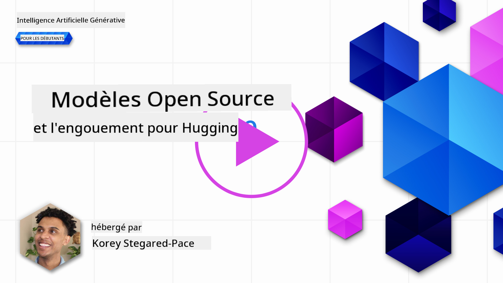
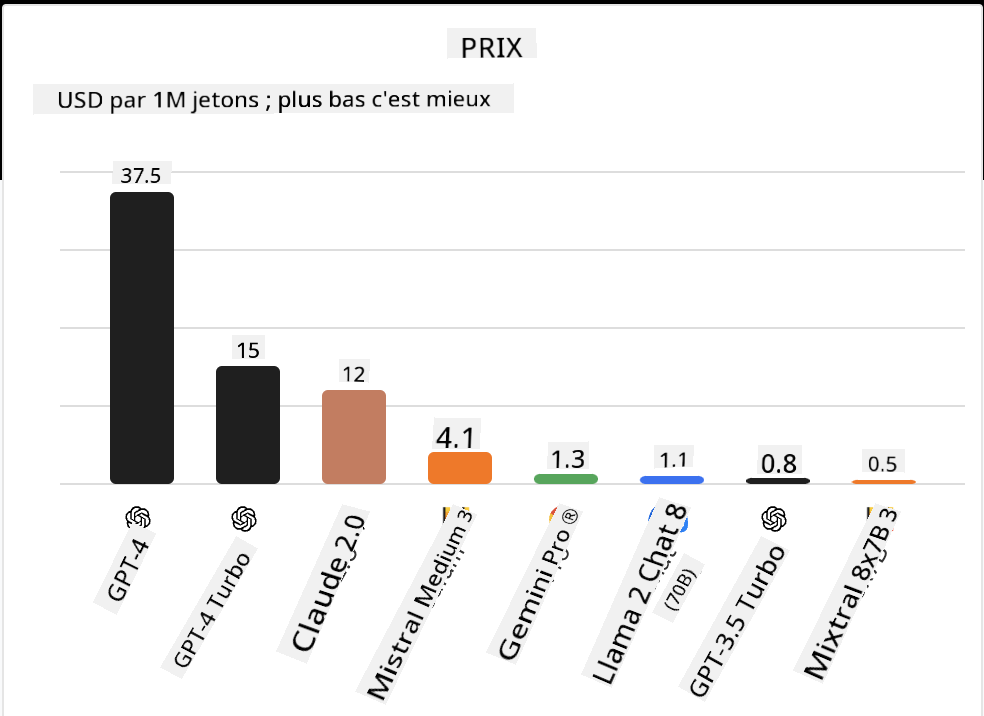
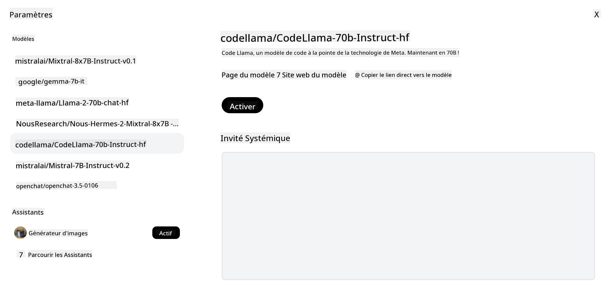
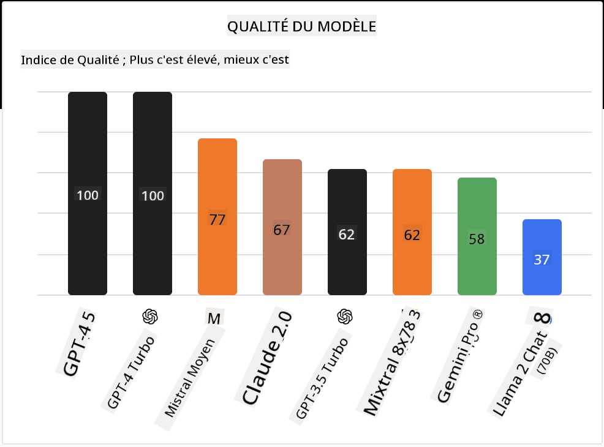

<!--
CO_OP_TRANSLATOR_METADATA:
{
  "original_hash": "0bba96e53ab841d99db731892a51fab8",
  "translation_date": "2025-05-20T06:45:19+00:00",
  "source_file": "16-open-source-models/README.md",
  "language_code": "fr"
}
-->

## Introduction

Le monde des LLM open source est passionnant et en constante évolution. Cette leçon vise à fournir un aperçu approfondi des modèles open source. Si vous cherchez des informations sur la comparaison entre les modèles propriétaires et les modèles open source, rendez-vous à la leçon ["Exploration et comparaison de différents LLM"](../02-exploring-and-comparing-different-llms/README.md?WT.mc_id=academic-105485-koreyst). Cette leçon couvrira également le sujet du fine-tuning, mais une explication plus détaillée peut être trouvée dans la leçon ["Fine-Tuning des LLM"](../18-fine-tuning/README.md?WT.mc_id=academic-105485-koreyst).

## Objectifs d'apprentissage

- Acquérir une compréhension des modèles open source
- Comprendre les avantages de travailler avec des modèles open source
- Explorer les modèles open disponibles sur Hugging Face et le Azure AI Studio

## Que sont les Modèles Open Source ?

Les logiciels open source ont joué un rôle crucial dans la croissance de la technologie dans divers domaines. L'Open Source Initiative (OSI) a défini [10 critères pour les logiciels](https://web.archive.org/web/20241126001143/https://opensource.org/osd?WT.mc_id=academic-105485-koreyst) pour être classifiés comme open source. Le code source doit être partagé ouvertement sous une licence approuvée par l'OSI.

Bien que le développement des LLM ait des éléments similaires à celui des logiciels, le processus n'est pas exactement le même. Cela a suscité de nombreuses discussions dans la communauté sur la définition de l'open source dans le contexte des LLM. Pour qu'un modèle soit aligné avec la définition traditionnelle de l'open source, les informations suivantes doivent être publiquement disponibles :

- Jeux de données utilisés pour entraîner le modèle.
- Poids complets du modèle dans le cadre de l'entraînement.
- Le code d'évaluation.
- Le code de fine-tuning.
- Poids complets du modèle et métriques d'entraînement.

Actuellement, il n'y a que quelques modèles qui correspondent à ces critères. Le [modèle OLMo créé par l'Allen Institute for Artificial Intelligence (AllenAI)](https://huggingface.co/allenai/OLMo-7B?WT.mc_id=academic-105485-koreyst) est un de ceux qui correspondent à cette catégorie.

Pour cette leçon, nous nous référerons aux modèles comme "modèles open" à l'avenir, car ils peuvent ne pas correspondre aux critères ci-dessus au moment de l'écriture.

## Avantages des Modèles Open

**Fortement Personnalisables** - Étant donné que les modèles open sont publiés avec des informations d'entraînement détaillées, les chercheurs et développeurs peuvent modifier les éléments internes du modèle. Cela permet la création de modèles hautement spécialisés qui sont ajustés pour une tâche ou un domaine d'étude spécifique. Quelques exemples de ceci sont la génération de code, les opérations mathématiques et la biologie.

**Coût** - Le coût par token pour utiliser et déployer ces modèles est inférieur à celui des modèles propriétaires. Lors de la création d'applications d'IA générative, il est important de comparer la performance et le prix lors de l'utilisation de ces modèles pour votre cas d'utilisation.

  
Source : Artificial Analysis

**Flexibilité** - Travailler avec des modèles open vous permet d'être flexible en termes d'utilisation de différents modèles ou de leur combinaison. Un exemple de cela est les [Assistants HuggingChat](https://huggingface.co/chat?WT.mc_id=academic-105485-koreyst) où un utilisateur peut sélectionner le modèle utilisé directement dans l'interface utilisateur :

## Exploration de Différents Modèles Open

### Llama 2

[LLama2](https://huggingface.co/meta-llama?WT.mc_id=academic-105485-koreyst), développé par Meta, est un modèle open optimisé pour les applications basées sur le chat. Cela est dû à sa méthode de fine-tuning, qui comprenait une grande quantité de dialogues et de retours humains. Avec cette méthode, le modèle produit des résultats plus alignés avec les attentes humaines, offrant une meilleure expérience utilisateur.

Quelques exemples de versions ajustées de Llama incluent [Japanese Llama](https://huggingface.co/elyza/ELYZA-japanese-Llama-2-7b?WT.mc_id=academic-105485-koreyst), qui se spécialise en japonais, et [Llama Pro](https://huggingface.co/TencentARC/LLaMA-Pro-8B?WT.mc_id=academic-105485-koreyst), qui est une version améliorée du modèle de base.

### Mistral

[Mistral](https://huggingface.co/mistralai?WT.mc_id=academic-105485-koreyst) est un modèle open avec un fort accent sur la haute performance et l'efficacité. Il utilise l'approche Mixture-of-Experts qui combine un groupe de modèles experts spécialisés en un seul système où, selon l'entrée, certains modèles sont sélectionnés pour être utilisés. Cela rend le calcul plus efficace car les modèles ne traitent que les entrées pour lesquelles ils sont spécialisés.

Quelques exemples de versions ajustées de Mistral incluent [BioMistral](https://huggingface.co/BioMistral/BioMistral-7B?text=Mon+nom+est+Thomas+et+mon+principal?WT.mc_id=academic-105485-koreyst), qui se concentre sur le domaine médical, et [OpenMath Mistral](https://huggingface.co/nvidia/OpenMath-Mistral-7B-v0.1-hf?WT.mc_id=academic-105485-koreyst), qui effectue des calculs mathématiques.

### Falcon

[Falcon](https://huggingface.co/tiiuae?WT.mc_id=academic-105485-koreyst) est un LLM créé par le Technology Innovation Institute (**TII**). Le Falcon-40B a été entraîné sur 40 milliards de paramètres, ce qui a montré qu'il performe mieux que GPT-3 avec un budget de calcul moindre. Cela est dû à son utilisation de l'algorithme FlashAttention et de l'attention multi-requêtes qui lui permet de réduire les besoins en mémoire lors de l'inférence. Avec ce temps d'inférence réduit, le Falcon-40B est adapté aux applications de chat.

Quelques exemples de versions ajustées de Falcon sont [OpenAssistant](https://huggingface.co/OpenAssistant/falcon-40b-sft-top1-560?WT.mc_id=academic-105485-koreyst), un assistant construit sur des modèles open, et [GPT4ALL](https://huggingface.co/nomic-ai/gpt4all-falcon?WT.mc_id=academic-105485-koreyst), qui offre des performances supérieures au modèle de base.

## Comment Choisir

Il n'y a pas de réponse unique pour choisir un modèle open. Un bon point de départ est d'utiliser la fonctionnalité de filtre par tâche de l'Azure AI Studio. Cela vous aidera à comprendre pour quels types de tâches le modèle a été entraîné. Hugging Face maintient également un classement des LLM qui vous montre les modèles les plus performants selon certains critères.

Lorsque vous cherchez à comparer les LLM entre les différents types, [Artificial Analysis](https://artificialanalysis.ai/?WT.mc_id=academic-105485-koreyst) est une autre excellente ressource :

  
Source : Artificial Analysis

Si vous travaillez sur un cas d'utilisation spécifique, chercher des versions ajustées qui se concentrent sur le même domaine peut être efficace. Expérimenter avec plusieurs modèles open pour voir comment ils performent selon vos attentes et celles de vos utilisateurs est une autre bonne pratique.

## Prochaines Étapes

La meilleure partie des modèles open est que vous pouvez commencer à travailler avec eux assez rapidement. Consultez le [Catalogue de Modèles Azure AI Studio](https://ai.azure.com?WT.mc_id=academic-105485-koreyst), qui présente une collection spécifique de Hugging Face avec les modèles que nous avons discutés ici.

## L'apprentissage ne s'arrête pas ici, continuez le voyage

Après avoir terminé cette leçon, consultez notre [collection d'apprentissage sur l'IA générative](https://aka.ms/genai-collection?WT.mc_id=academic-105485-koreyst) pour continuer à approfondir vos connaissances en IA générative !

**Avertissement** :  
Ce document a été traduit à l'aide du service de traduction IA [Co-op Translator](https://github.com/Azure/co-op-translator). Bien que nous nous efforcions d'assurer l'exactitude, veuillez noter que les traductions automatiques peuvent contenir des erreurs ou des inexactitudes. Le document original dans sa langue d'origine doit être considéré comme la source faisant autorité. Pour des informations critiques, il est recommandé de recourir à une traduction humaine professionnelle. Nous ne sommes pas responsables des malentendus ou des mauvaises interprétations résultant de l'utilisation de cette traduction.