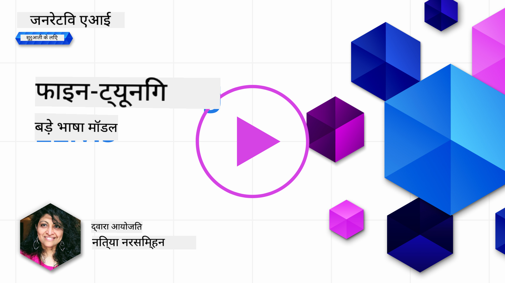
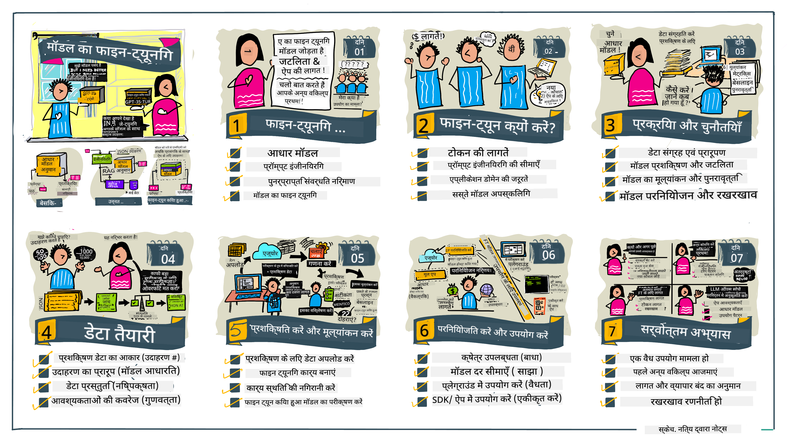

<!--
CO_OP_TRANSLATOR_METADATA:
{
  "original_hash": "68664f7e754a892ae1d8d5e2b7bd2081",
  "translation_date": "2025-05-20T07:41:31+00:00",
  "source_file": "18-fine-tuning/README.md",
  "language_code": "hi"
}
-->

# अपने LLM को फाइन-ट्यून करना

बड़े भाषा मॉडल का उपयोग करके जनरेटिव AI एप्लिकेशन बनाना नए चुनौतियों के साथ आता है। एक मुख्य समस्या यह सुनिश्चित करना है कि उपयोगकर्ता के अनुरोध के लिए मॉडल द्वारा उत्पन्न सामग्री में प्रतिक्रिया की गुणवत्ता (सटीकता और प्रासंगिकता) हो। पिछले पाठों में, हमने प्रॉम्प्ट इंजीनियरिंग और रिट्रीवल-ऑगमेंटेड जनरेशन जैसी तकनीकों पर चर्चा की, जो मौजूदा मॉडल में _प्रॉम्प्ट इनपुट को संशोधित करके_ समस्या को हल करने की कोशिश करती हैं।

आज के पाठ में, हम एक तीसरी तकनीक, **फाइन-ट्यूनिंग**, पर चर्चा करेंगे, जो अतिरिक्त डेटा के साथ _मॉडल को पुनः प्रशिक्षण_ देकर चुनौती का समाधान करने की कोशिश करती है। आइए विवरण में जाएं।

## सीखने के उद्देश्य

यह पाठ पूर्व-प्रशिक्षित भाषा मॉडलों के लिए फाइन-ट्यूनिंग की अवधारणा का परिचय देता है, इस दृष्टिकोण के लाभ और चुनौतियों की जांच करता है, और आपके जनरेटिव AI मॉडलों के प्रदर्शन को सुधारने के लिए कब और कैसे फाइन-ट्यूनिंग का उपयोग किया जाए, इस पर मार्गदर्शन प्रदान करता है।

पाठ के अंत तक, आपको निम्नलिखित प्रश्नों का उत्तर देने में सक्षम होना चाहिए:

- भाषा मॉडलों के लिए फाइन-ट्यूनिंग क्या है?
- फाइन-ट्यूनिंग कब और क्यों उपयोगी है?
- मैं एक पूर्व-प्रशिक्षित मॉडल को कैसे फाइन-ट्यून कर सकता हूं?
- फाइन-ट्यूनिंग की सीमाएं क्या हैं?

तैयार हैं? चलिए शुरू करते हैं।

## चित्रित मार्गदर्शिका

क्या आप dive in करने से पहले जानना चाहते हैं कि हम क्या कवर करेंगे? इस चित्रित मार्गदर्शिका को देखें जो इस पाठ के लिए सीखने की यात्रा का वर्णन करती है - फाइन-ट्यूनिंग के मुख्य अवधारणाओं और प्रेरणा से सीखने से लेकर, प्रक्रिया और फाइन-ट्यूनिंग कार्य को निष्पादित करने के सर्वोत्तम अभ्यासों को समझने तक। यह एक रोमांचक विषय है, इसलिए अपनी आत्म-निर्देशित सीखने की यात्रा का समर्थन करने के लिए अतिरिक्त लिंक के लिए [Resources](./RESOURCES.md?WT.mc_id=academic-105485-koreyst) पृष्ठ देखना न भूलें!

## भाषा मॉडलों के लिए फाइन-ट्यूनिंग क्या है?

परिभाषा के अनुसार, बड़े भाषा मॉडल इंटरनेट सहित विविध स्रोतों से प्राप्त बड़े मात्रा के टेक्स्ट पर _पूर्व-प्रशिक्षित_ होते हैं। जैसा कि हमने पिछले पाठों में सीखा है, हमें उपयोगकर्ता के प्रश्नों ("प्रॉम्प्ट्स") के लिए मॉडल की प्रतिक्रियाओं की गुणवत्ता में सुधार करने के लिए _प्रॉम्प्ट इंजीनियरिंग_ और _रिट्रीवल-ऑगमेंटेड जनरेशन_ जैसी तकनीकों की आवश्यकता होती है।

एक लोकप्रिय प्रॉम्प्ट-इंजीनियरिंग तकनीक में प्रतिक्रिया में अपेक्षित चीज़ों पर मॉडल को अधिक मार्गदर्शन देना शामिल है, या तो _निर्देश_ (स्पष्ट मार्गदर्शन) प्रदान करके या _कुछ उदाहरण_ देकर (अस्पष्ट मार्गदर्शन)। इसे _फ्यू-शॉट लर्निंग_ कहा जाता है लेकिन इसके दो सीमाएं होती हैं:

- मॉडल टोकन सीमाएं आपको दिए जा सकने वाले उदाहरणों की संख्या को सीमित कर सकती हैं, और प्रभावशीलता को सीमित कर सकती हैं।
- मॉडल टोकन लागत हर प्रॉम्प्ट में उदाहरण जोड़ने को महंगा बना सकती है, और लचीलापन सीमित कर सकती है।

फाइन-ट्यूनिंग मशीन लर्निंग सिस्टम में एक सामान्य अभ्यास है जहां हम एक पूर्व-प्रशिक्षित मॉडल लेते हैं और एक विशिष्ट कार्य पर इसके प्रदर्शन को सुधारने के लिए इसे नए डेटा के साथ पुनः प्रशिक्षित करते हैं। भाषा मॉडलों के संदर्भ में, हम पूर्व-प्रशिक्षित मॉडल को _एक दिए गए कार्य या एप्लिकेशन डोमेन के लिए एक क्यूरेटेड सेट ऑफ उदाहरणों के साथ_ फाइन-ट्यून कर सकते हैं ताकि एक **कस्टम मॉडल** बनाया जा सके जो उस विशिष्ट कार्य या डोमेन के लिए अधिक सटीक और प्रासंगिक हो सकता है। फाइन-ट्यूनिंग का एक साइड-बेनिफिट यह है कि यह फ्यू-शॉट लर्निंग के लिए आवश्यक उदाहरणों की संख्या को भी कम कर सकता है - टोकन उपयोग और संबंधित लागत को कम कर सकता है।

## हमें मॉडल्स को कब और क्यों फाइन-ट्यून करना चाहिए?

_इस_ संदर्भ में, जब हम फाइन-ट्यूनिंग की बात करते हैं, तो हम **सुपरवाइज्ड** फाइन-ट्यूनिंग का उल्लेख कर रहे हैं जहां पुनः प्रशिक्षण **नए डेटा जोड़कर** किया जाता है जो मूल प्रशिक्षण डेटासेट का हिस्सा नहीं था। यह एक अनसुपरवाइज्ड फाइन-ट्यूनिंग दृष्टिकोण से अलग है जहां मॉडल को मूल डेटा पर, लेकिन विभिन्न हाइपरपैरामीटर्स के साथ पुनः प्रशिक्षित किया जाता है।

मुख्य बात याद रखने की यह है कि फाइन-ट्यूनिंग एक उन्नत तकनीक है जो इच्छित परिणाम प्राप्त करने के लिए एक निश्चित स्तर की विशेषज्ञता की आवश्यकता होती है। यदि गलत तरीके से किया जाता है, तो यह अपेक्षित सुधार प्रदान नहीं कर सकता है, और आपके लक्षित डोमेन के लिए मॉडल के प्रदर्शन को भी खराब कर सकता है।

तो, भाषा मॉडलों को "कैसे" फाइन-ट्यून करना सीखने से पहले, आपको यह जानना चाहिए कि "क्यों" आपको इस मार्ग को लेना चाहिए, और "कब" फाइन-ट्यूनिंग की प्रक्रिया शुरू करनी चाहिए। इन प्रश्नों से शुरू करें:

- **उपयोग का मामला**: आपका फाइन-ट्यूनिंग के लिए _उपयोग का मामला_ क्या है? वर्तमान पूर्व-प्रशिक्षित मॉडल के किस पहलू को आप सुधारना चाहते हैं?
- **विकल्प**: क्या आपने इच्छित परिणाम प्राप्त करने के लिए _अन्य तकनीकों_ की कोशिश की है? तुलना के लिए एक आधार रेखा बनाने के लिए उनका उपयोग करें।
  - प्रॉम्प्ट इंजीनियरिंग: प्रासंगिक प्रॉम्प्ट प्रतिक्रियाओं के उदाहरणों के साथ फ्यू-शॉट प्रॉम्प्टिंग जैसी तकनीकों की कोशिश करें। प्रतिक्रियाओं की गुणवत्ता का मूल्यांकन करें।
  - रिट्रीवल ऑगमेंटेड जनरेशन: अपने डेटा को खोजकर प्राप्त किए गए क्वेरी परिणामों के साथ प्रॉम्प्ट्स को ऑगमेंट करने की कोशिश करें। प्रतिक्रियाओं की गुणवत्ता का मूल्यांकन करें।
- **लागत**: क्या आपने फाइन-ट्यूनिंग के लिए लागत की पहचान की है?
  - ट्यूनबिलिटी - क्या पूर्व-प्रशिक्षित मॉडल फाइन-ट्यूनिंग के लिए उपलब्ध है?
  - प्रयास - प्रशिक्षण डेटा तैयार करने, मॉडल का मूल्यांकन और सुधार के लिए।
  - कंप्यूट - फाइन-ट्यूनिंग जॉब्स चलाने और फाइन-ट्यून किए गए मॉडल को तैनात करने के लिए
  - डेटा - फाइन-ट्यूनिंग प्रभाव के लिए पर्याप्त गुणवत्ता उदाहरणों तक पहुंच
- **लाभ**: क्या आपने फाइन-ट्यूनिंग के लाभों की पुष्टि की है?
  - गुणवत्ता - क्या फाइन-ट्यून किया गया मॉडल आधार रेखा से बेहतर प्रदर्शन करता है?
  - लागत - क्या यह प्रॉम्प्ट्स को सरल बनाकर टोकन उपयोग को कम करता है?
  - एक्स्टेंसिबिलिटी - क्या आप नए डोमेन के लिए बेस मॉडल को पुनः प्रयोजन कर सकते हैं?

इन प्रश्नों का उत्तर देकर, आपको यह तय करने में सक्षम होना चाहिए कि आपके उपयोग के मामले के लिए फाइन-ट्यूनिंग सही दृष्टिकोण है या नहीं। आदर्श रूप से, दृष्टिकोण तभी मान्य है जब लाभ लागत से अधिक हो। एक बार जब आप आगे बढ़ने का निर्णय लेते हैं, तो यह सोचने का समय है कि _कैसे_ आप पूर्व-प्रशिक्षित मॉडल को फाइन-ट्यून कर सकते हैं।

निर्णय लेने की प्रक्रिया पर अधिक अंतर्दृष्टि प्राप्त करना चाहते हैं? देखें [फाइन-ट्यून करना या न करना](https://www.youtube.com/watch?v=0Jo-z-MFxJs)

## हम एक पूर्व-प्रशिक्षित मॉडल को कैसे फाइन-ट्यून कर सकते हैं?

एक पूर्व-प्रशिक्षित मॉडल को फाइन-ट्यून करने के लिए, आपके पास होना चाहिए:

- एक पूर्व-प्रशिक्षित मॉडल जिसे फाइन-ट्यून करना है
- फाइन-ट्यूनिंग के लिए उपयोग करने के लिए एक डेटासेट
- फाइन-ट्यूनिंग जॉब चलाने के लिए एक प्रशिक्षण वातावरण
- फाइन-ट्यून किए गए मॉडल को तैनात करने के लिए एक होस्टिंग वातावरण

## फाइन-ट्यूनिंग इन एक्शन

निम्नलिखित संसाधन आपको चयनित मॉडल के साथ एक क्यूरेटेड डेटासेट का उपयोग करके एक वास्तविक उदाहरण के माध्यम से कदम-दर-कदम ट्यूटोरियल प्रदान करते हैं। इन ट्यूटोरियल्स के माध्यम से काम करने के लिए, आपको विशिष्ट प्रदाता पर एक खाता चाहिए, साथ ही संबंधित मॉडल और डेटासेट तक पहुंच चाहिए।

| प्रदाता     | ट्यूटोरियल                                                                                                                                                                       | विवरण                                                                                                                                                                                                                                                                                                                                                                                                                        |
| ------------ | ------------------------------------------------------------------------------------------------------------------------------------------------------------------------------ | ---------------------------------------------------------------------------------------------------------------------------------------------------------------------------------------------------------------------------------------------------------------------------------------------------------------------------------------------------------------------------------------------------------------------------------- |
| OpenAI       | [कैसे चैट मॉडल्स को फाइन-ट्यून करें](https://github.com/openai/openai-cookbook/blob/main/examples/How_to_finetune_chat_models.ipynb?WT.mc_id=academic-105485-koreyst)                | एक विशेष डोमेन ("रेसिपी सहायक") के लिए एक `gpt-35-turbo` को फाइन-ट्यून करना सीखें, प्रशिक्षण डेटा तैयार करके, फाइन-ट्यूनिंग जॉब चलाकर, और अनुमान के लिए फाइन-ट्यून किए गए मॉडल का उपयोग करके।                                                                                                                                                                                                                                              |
| Azure OpenAI | [GPT 3.5 टर्बो फाइन-ट्यूनिंग ट्यूटोरियल](https://learn.microsoft.com/azure/ai-services/openai/tutorials/fine-tune?tabs=python-new%2Ccommand-line?WT.mc_id=academic-105485-koreyst) | **Azure पर** एक `gpt-35-turbo-0613` मॉडल को फाइन-ट्यून करना सीखें, प्रशिक्षण डेटा बनाने और अपलोड करने के कदम उठाकर, फाइन-ट्यूनिंग जॉब चलाकर। नए मॉडल को तैनात करें और उपयोग करें।                                                                                                                                                                                                                                                                 |
| Hugging Face | [Hugging Face के साथ LLMs को फाइन-ट्यून करना](https://www.philschmid.de/fine-tune-llms-in-2024-with-trl?WT.mc_id=academic-105485-koreyst)                                               | यह ब्लॉग पोस्ट आपको एक _ओपन LLM_ (उदाहरण: `CodeLlama 7B`) को [transformers](https://huggingface.co/docs/transformers/index?WT.mc_id=academic-105485-koreyst) लाइब्रेरी और [Transformer Reinforcement Learning (TRL)](https://huggingface.co/docs/trl/index?WT.mc_id=academic-105485-koreyst]) के साथ खुले [datasets](https://huggingface.co/docs/datasets/index?WT.mc_id=academic-105485-koreyst) पर Hugging Face पर फाइन-ट्यूनिंग करता है। |
|              |                                                                                                                                                                                |                                                                                                                                                                                                                                                                                                                                                                                                                                    |
| 🤗 AutoTrain | [AutoTrain के साथ LLMs को फाइन-ट्यून करना](https://github.com/huggingface/autotrain-advanced/?WT.mc_id=academic-105485-koreyst)                                                         | AutoTrain (या AutoTrain Advanced) एक पायथन लाइब्रेरी है जिसे Hugging Face द्वारा विकसित किया गया है जो LLM फाइन-ट्यूनिंग सहित कई विभिन्न कार्यों के लिए फाइन-ट्यूनिंग की अनुमति देता है। AutoTrain एक नो-कोड समाधान है और फाइन-ट्यूनिंग आपके स्वयं के क्लाउड में, Hugging Face Spaces पर या स्थानीय रूप से किया जा सकता है। यह वेब-आधारित GUI, CLI और yaml कॉन्फ़िग फ़ाइलों के माध्यम से प्रशिक्षण दोनों का समर्थन करता है।                                                                               |
|              |                                                                                                                                                                                |                                                                                                                                                                                                                                                                                                                                                                                                                                    |

## असाइनमेंट

उपरोक्त ट्यूटोरियल्स में से एक का चयन करें और उनके माध्यम से चलें। _हम इस रिपॉजिटरी में संदर्भ के लिए इन ट्यूटोरियल्स का एक संस्करण Jupyter Notebooks में दोहरा सकते हैं। कृपया नवीनतम संस्करण प्राप्त करने के लिए सीधे मूल स्रोतों का उपयोग करें_।

## शानदार काम! अपनी सीखने की यात्रा जारी रखें।

इस पाठ को पूरा करने के बाद, हमारे [Generative AI Learning संग्रह](https://aka.ms/genai-collection?WT.mc_id=academic-105485-koreyst) को देखें ताकि आप अपने जनरेटिव AI ज्ञान को आगे बढ़ा सकें!

बधाई हो!! आपने इस कोर्स के v2 श्रृंखला का अंतिम पाठ पूरा कर लिया है! सीखना और बनाना बंद न करें। \*\*इस विषय के लिए अतिरिक्त सुझावों की सूची के लिए [RESOURCES](RESOURCES.md?WT.mc_id=academic-105485-koreyst) पृष्ठ देखें।

हमारे v1 श्रृंखला के पाठों को भी अधिक असाइनमेंट और अवधारणाओं के साथ अपडेट किया गया है। तो एक मिनट लें और अपने ज्ञान को ताज़ा करें - और कृपया [अपने प्रश्न और फीडबैक साझा करें](https://github.com/microsoft/generative-ai-for-beginners/issues?WT.mc_id=academic-105485-koreyst) ताकि हम इन पाठों को समुदाय के लिए सुधार सकें।

**अस्वीकरण**:  
इस दस्तावेज़ का अनुवाद AI अनुवाद सेवा [Co-op Translator](https://github.com/Azure/co-op-translator) का उपयोग करके किया गया है। जबकि हम सटीकता के लिए प्रयासरत हैं, कृपया ध्यान दें कि स्वचालित अनुवाद में त्रुटियाँ या गलतियाँ हो सकती हैं। मूल भाषा में मूल दस्तावेज़ को आधिकारिक स्रोत माना जाना चाहिए। महत्वपूर्ण जानकारी के लिए, पेशेवर मानव अनुवाद की सिफारिश की जाती है। इस अनुवाद के उपयोग से उत्पन्न किसी भी गलतफहमी या गलत व्याख्या के लिए हम उत्तरदायी नहीं हैं।