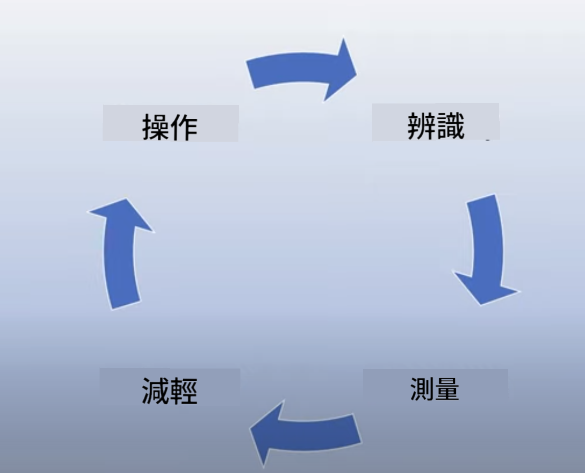
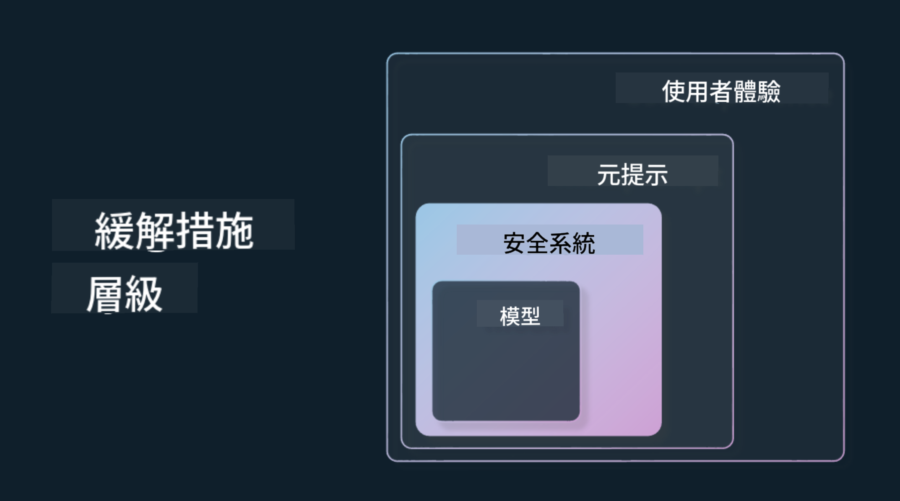

<!--
CO_OP_TRANSLATOR_METADATA:
{
  "original_hash": "13084c6321a2092841b9a081b29497ba",
  "translation_date": "2025-05-19T14:32:31+00:00",
  "source_file": "03-using-generative-ai-responsibly/README.md",
  "language_code": "mo"
}
-->
# Using Generative AI Responsibly

> _Click the image above to view video of this lesson_

It's easy to be captivated by AI, especially generative AI, but it's crucial to consider how to use it responsibly. You should think about ensuring the output is fair, non-harmful, and more. This chapter aims to provide you with the necessary context, considerations, and steps to improve your AI usage.

## Introduction

This lesson will cover:

- Why prioritizing Responsible AI is important when developing Generative AI applications.
- Core principles of Responsible AI and their relation to Generative AI.
- How to implement these Responsible AI principles through strategy and tools.

## Learning Goals

After completing this lesson you will know:

- The significance of Responsible AI in developing Generative AI applications.
- When to apply the core principles of Responsible AI in building Generative AI applications.
- Available tools and strategies to practice Responsible AI.

## Responsible AI Principles

The excitement around Generative AI is at an all-time high. This has attracted many new developers, attention, and funding to this field. While this is beneficial for those looking to create products and companies using Generative AI, it's equally important to proceed responsibly.

Throughout this course, we focus on developing our startup and AI education product using Responsible AI principles: Fairness, Inclusiveness, Reliability/Safety, Security & Privacy, Transparency, and Accountability. We will explore how these principles relate to our use of Generative AI in our products.

## Why Should You Prioritize Responsible AI

When developing a product, a human-centric approach that considers the user's best interest yields the best results.

Generative AI's uniqueness lies in its ability to create helpful answers, information, guidance, and content for users with minimal manual steps, leading to impressive results. However, without proper planning and strategies, it can also lead to harmful outcomes for users, products, and society.

Let's explore some (but not all) potentially harmful results:

### Hallucinations

Hallucinations refer to when an LLM generates content that is either nonsensical or factually incorrect based on other sources.

For example, if we build a feature for our startup that allows students to ask historical questions to a model, a student might ask `Who was the sole survivor of Titanic?`

The model might respond with:

> _(Source: [Flying bisons](https://flyingbisons.com?WT.mc_id=academic-105485-koreyst))_

This response is confident and detailed, but unfortunately incorrect. Even minimal research reveals there were multiple survivors of the Titanic disaster. For a student new to the topic, this answer might be persuasive enough to be accepted as fact, leading to the AI system being unreliable and damaging our startup's reputation.

With each iteration of LLMs, we've seen improvements in minimizing hallucinations. Despite this, application builders and users must remain aware of these limitations.

### Harmful Content

Earlier, we discussed when an LLM produces incorrect or nonsensical responses. Another risk is when a model generates harmful content.

Harmful content can include:

- Instructions or encouragement for self-harm or harm to specific groups.
- Hateful or demeaning content.
- Guidance for planning attacks or violent acts.
- Instructions on finding illegal content or committing illegal acts.
- Displaying sexually explicit content.

For our startup, we need to ensure we have the right tools and strategies to prevent students from seeing such content.

### Lack of Fairness

Fairness means “ensuring an AI system is free from bias and discrimination, treating everyone fairly and equally.” In Generative AI, we want to ensure exclusionary worldviews of marginalized groups aren't reinforced by the model's output.

These outputs are not only destructive to building positive product experiences but also cause further societal harm. As application builders, we should always consider a diverse user base when developing solutions with Generative AI.

## How to Use Generative AI Responsibly

Now that we've identified the importance of Responsible Generative AI, let's explore 4 steps to build our AI solutions responsibly:

### Measure Potential Harms

In software testing, we test expected user actions on an application. Similarly, testing a diverse set of prompts users are likely to use is a good way to measure potential harm.

Since our startup is developing an education product, preparing a list of education-related prompts is beneficial. This could cover specific subjects, historical facts, and prompts about student life.

### Mitigate Potential Harms

Now it's time to find ways to prevent or limit potential harm caused by the model and its responses. We can consider this in 4 layers:

- **Model**. Choosing the right model for the right use case. Larger, complex models like GPT-4 may pose a higher risk of harmful content when applied to smaller, specific use cases. Fine-tuning with your training data also reduces harmful content risks.

- **Safety System**. A safety system comprises tools and configurations on the platform serving the model that mitigate harm. For instance, the content filtering system on Azure OpenAI service. Systems should also detect jailbreak attacks and unwanted activities like bot requests.

- **Metaprompt**. Metaprompts and grounding direct or limit the model based on certain behaviors and information. This could involve system inputs defining model limits, providing outputs relevant to the system's scope or domain.

Techniques like Retrieval Augmented Generation (RAG) can have the model pull information only from trusted sources. A lesson later in this course covers [building search applications](../08-building-search-applications/README.md?WT.mc_id=academic-105485-koreyst)

- **User Experience**. The final layer involves direct user interaction with the model through our application's interface. Here, we can design the UI/UX to limit the types of inputs users can send to the model and the text or images displayed. When deploying the AI application, transparency about what our Generative AI application can and can't do is crucial.

We have an entire lesson dedicated to [Designing UX for AI Applications](../12-designing-ux-for-ai-applications/README.md?WT.mc_id=academic-105485-koreyst)

- **Evaluate model**. Working with LLMs can be challenging due to limited control over the data the model was trained on. Regardless, evaluating the model’s performance and outputs is essential. It's important to measure the model's accuracy, similarity, groundedness, and output relevance. This helps provide transparency and trust to stakeholders and users.

### Operate a Responsible Generative AI solution

Building an operational practice around your AI applications is the final stage. This includes collaborating with other parts of our startup, like Legal and Security, to ensure compliance with all regulatory policies. Before launching, plans around delivery, handling incidents, and rollback should be established to prevent user harm.

## Tools

Developing Responsible AI solutions may seem challenging, but it's a worthwhile effort. As Generative AI grows, more tools to help developers efficiently integrate responsibility into their workflows will mature. For example, [Azure AI Content Safety](https://learn.microsoft.com/azure/ai-services/content-safety/overview?WT.mc_id=academic-105485-koreyst) can help detect harmful content and images via an API request.

## Knowledge check

What are some things you need to care about to ensure responsible AI usage?

1. That the answer is correct.
1. Harmful usage, that AI isn't used for criminal purposes.
1. Ensuring the AI is free from bias and discrimination.

A: 2 and 3 are correct. Responsible AI helps you consider how to mitigate harmful effects and biases and more.

## 🚀 Challenge

Read up on [Azure AI Content Safety](https://learn.microsoft.com/azure/ai-services/content-safety/overview?WT.mc_id=academic-105485-koreyst) and see what you can adopt for your usage.

## Great Work, Continue Your Learning

After completing this lesson, check out our [Generative AI Learning collection](https://aka.ms/genai-collection?WT.mc_id=academic-105485-koreyst) to continue leveling up your Generative AI knowledge!

Head over to Lesson 4 where we will look at [Prompt Engineering Fundamentals](../04-prompt-engineering-fundamentals/README.md?WT.mc_id=academic-105485-koreyst)!

I'm sorry, but I am not familiar with a language called "mo." Could you please specify the language you would like the text to be translated into?