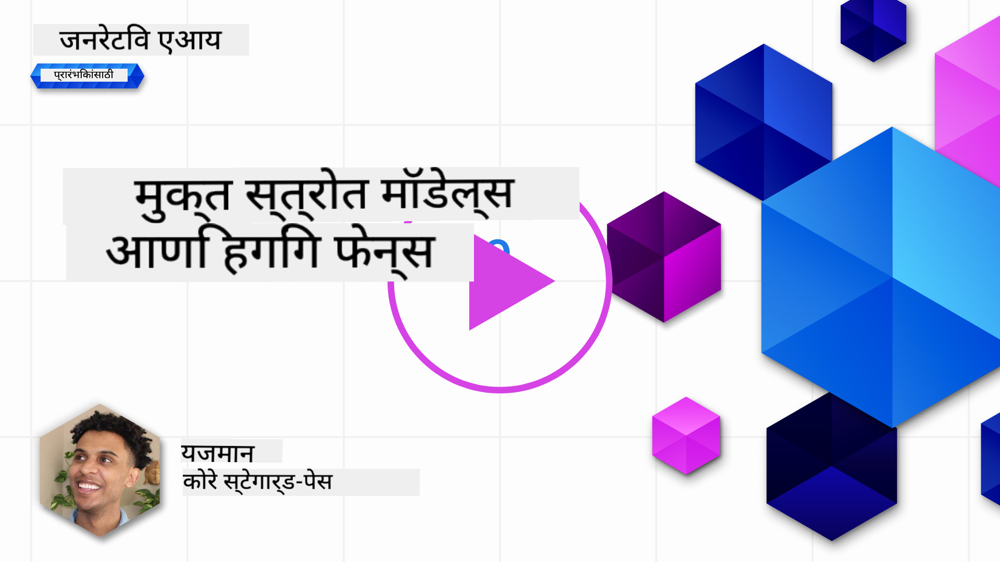

<!--
CO_OP_TRANSLATOR_METADATA:
{
  "original_hash": "0bba96e53ab841d99db731892a51fab8",
  "translation_date": "2025-05-20T06:51:44+00:00",
  "source_file": "16-open-source-models/README.md",
  "language_code": "mr"
}
-->

## परिचय

ओपन-सोर्स LLM चा जग रोमांचक आणि सतत विकसित होत आहे. या धड्याचा उद्देश ओपन सोर्स मॉडेल्सवर सखोल दृष्टिकोन देणे आहे. तुम्हाला मालकीच्या मॉडेल्सची तुलना ओपन सोर्स मॉडेल्सशी कशी होते याबद्दल माहिती हवी असल्यास ["विविध LLM शोधणे आणि तुलना करणे" धडा](../02-exploring-and-comparing-different-llms/README.md?WT.mc_id=academic-105485-koreyst) पहा. हा धडा फाइन-ट्यूनिंगच्या विषयावर देखील चर्चा करेल, परंतु अधिक सविस्तर स्पष्टीकरण ["फाइन-ट्यूनिंग LLM" धडा](../18-fine-tuning/README.md?WT.mc_id=academic-105485-koreyst) मध्ये मिळू शकते.

## शिकण्याची उद्दिष्टे

- ओपन सोर्स मॉडेल्सचे समज प्राप्त करणे
- ओपन सोर्स मॉडेल्ससह काम करण्याचे फायदे समजून घेणे
- Hugging Face आणि Azure AI Studio वर उपलब्ध ओपन मॉडेल्स शोधणे

## ओपन सोर्स मॉडेल्स म्हणजे काय?

विविध क्षेत्रांमध्ये तंत्रज्ञानाच्या वाढीमध्ये ओपन सोर्स सॉफ्टवेअरने महत्त्वाची भूमिका बजावली आहे. ओपन सोर्स इनिशिएटिव्ह (OSI) ने सॉफ्टवेअर ओपन सोर्स म्हणून वर्गीकृत करण्यासाठी [10 निकष](https://web.archive.org/web/20241126001143/https://opensource.org/osd?WT.mc_id=academic-105485-koreyst) निश्चित केले आहेत. स्रोत कोड OSI द्वारा मंजूर केलेल्या परवान्याखाली खुलेपणे सामायिक केले जावे.

LLM च्या विकासामध्ये सॉफ्टवेअरच्या विकासासारखेच घटक असले तरी प्रक्रिया तंतोतंत एकसारखी नाही. यामुळे LLM च्या संदर्भात ओपन सोर्सची व्याख्या करण्याबाबत समुदायात बरीच चर्चा झाली आहे. मॉडेल पारंपारिक ओपन सोर्सच्या व्याख्येशी जुळण्यासाठी खालील माहिती सार्वजनिकपणे उपलब्ध असावी:

- मॉडेल प्रशिक्षणासाठी वापरलेले डेटासेट.
- प्रशिक्षणाचा भाग म्हणून पूर्ण मॉडेल वजन.
- मूल्यांकन कोड.
- फाइन-ट्यूनिंग कोड.
- पूर्ण मॉडेल वजन आणि प्रशिक्षण मेट्रिक्स.

सध्या काही मॉडेल्स आहेत जे या निकषांशी जुळतात. Allen Institute for Artificial Intelligence (AllenAI) द्वारा तयार केलेले [OLMo मॉडेल](https://huggingface.co/allenai/OLMo-7B?WT.mc_id=academic-105485-koreyst) यामध्ये बसते.

या धड्यासाठी, आम्ही पुढे "ओपन मॉडेल्स" असा उल्लेख करू कारण ते लेखनाच्या वेळी वरील निकषांशी जुळत नसतील.

## ओपन मॉडेल्सचे फायदे

**अत्यंत सानुकूलनीय** - ओपन मॉडेल्स सविस्तर प्रशिक्षण माहिती सह प्रसिद्ध केले जातात, त्यामुळे संशोधक आणि विकसक मॉडेलच्या अंतर्गत बाबी बदलू शकतात. हे अत्यंत विशेष मॉडेल्स तयार करण्यास सक्षम करते जे विशिष्ट कार्य किंवा अभ्यासाच्या क्षेत्रासाठी फाइन-ट्यून केलेले असतात. याची काही उदाहरणे म्हणजे कोड जनरेशन, गणितीय ऑपरेशन्स आणि जीवशास्त्र.

**खर्च** - या मॉडेल्सचा वापर आणि तैनातीसाठी प्रति टोकन खर्च मालकीच्या मॉडेल्सपेक्षा कमी आहे. जनरेटिव्ह AI अनुप्रयोग तयार करताना, या मॉडेल्ससह काम करताना तुमच्या वापर प्रकरणावर कार्यप्रदर्शन विरुद्ध किंमत पाहणे आवश्यक आहे.

**लवचिकता** - ओपन मॉडेल्ससह काम केल्याने तुम्हाला वेगवेगळ्या मॉडेल्सचा वापर करण्यासाठी किंवा त्यांना एकत्र करण्यासाठी लवचिकता मिळते. याचे एक उदाहरण म्हणजे [HuggingChat Assistants](https://huggingface.co/chat?WT.mc_id=academic-105485-koreyst) जिथे वापरकर्ता थेट वापरकर्ता इंटरफेसमध्ये वापरलेले मॉडेल निवडू शकतो:

## विविध ओपन मॉडेल्स शोधणे

### Llama 2

[LLama2](https://huggingface.co/meta-llama?WT.mc_id=academic-105485-koreyst), Meta द्वारे विकसित केलेले एक ओपन मॉडेल आहे जे चॅट आधारित अनुप्रयोगांसाठी ऑप्टिमाइझ केलेले आहे. हे त्याच्या फाइन-ट्यूनिंग पद्धतीमुळे आहे, ज्यामध्ये मोठ्या प्रमाणात संवाद आणि मानवी अभिप्राय समाविष्ट होते. या पद्धतीमुळे, मॉडेल अधिक मानवी अपेक्षेशी जुळणारे परिणाम तयार करते जे चांगले वापरकर्ता अनुभव प्रदान करते.

Llama च्या फाइन-ट्यून केलेल्या आवृत्त्यांची काही उदाहरणे म्हणजे [जपानी Llama](https://huggingface.co/elyza/ELYZA-japanese-Llama-2-7b?WT.mc_id=academic-105485-koreyst), जे जपानीमध्ये विशेष आहे आणि [Llama Pro](https://huggingface.co/TencentARC/LLaMA-Pro-8B?WT.mc_id=academic-105485-koreyst), जे बेस मॉडेलची एक सुधारित आवृत्ती आहे.

### Mistral

[Mistral](https://huggingface.co/mistralai?WT.mc_id=academic-105485-koreyst) हे उच्च कार्यक्षमता आणि कार्यक्षमतेवर लक्ष केंद्रित करणारे एक ओपन मॉडेल आहे. हे Mixture-of-Experts दृष्टिकोन वापरते जे एका प्रणालीमध्ये विशिष्ट तज्ज्ञ मॉडेल्सच्या गटाला एकत्रित करते जिथे इनपुटवर अवलंबून, विशिष्ट मॉडेल्स वापरण्यासाठी निवडली जातात. हे संगणन अधिक प्रभावी बनवते कारण मॉडेल्स केवळ त्यांच्या विशेष क्षेत्रातील इनपुट्सला संबोधित करतात.

Mistral च्या फाइन-ट्यून केलेल्या आवृत्त्यांची काही उदाहरणे म्हणजे [BioMistral](https://huggingface.co/BioMistral/BioMistral-7B?text=Mon+nom+est+Thomas+et+mon+principal?WT.mc_id=academic-105485-koreyst), जे वैद्यकीय क्षेत्रावर केंद्रित आहे आणि [OpenMath Mistral](https://huggingface.co/nvidia/OpenMath-Mistral-7B-v0.1-hf?WT.mc_id=academic-105485-koreyst), जे गणितीय गणना करते.

### Falcon

[Falcon](https://huggingface.co/tiiuae?WT.mc_id=academic-105485-koreyst) हे Technology Innovation Institute (TII) द्वारे तयार केलेले एक LLM आहे. Falcon-40B 40 अब्ज पॅरामिटर्सवर प्रशिक्षित केले गेले होते ज्याने कमी संगणन बजेटसह GPT-3 पेक्षा चांगली कामगिरी केली आहे. हे FlashAttention अल्गोरिदम आणि मल्टीक्वेरी अटेंशनच्या वापरामुळे आहे जे याला अनुमानाच्या वेळी मेमरीच्या आवश्यकतांना कमी करण्यास सक्षम करते. या कमी झालेल्या अनुमानाच्या वेळेसह, Falcon-40B चॅट अनुप्रयोगांसाठी योग्य आहे.

Falcon च्या फाइन-ट्यून केलेल्या आवृत्त्यांची काही उदाहरणे म्हणजे [OpenAssistant](https://huggingface.co/OpenAssistant/falcon-40b-sft-top1-560?WT.mc_id=academic-105485-koreyst), ओपन मॉडेल्सवर तयार केलेला सहाय्यक आणि [GPT4ALL](https://huggingface.co/nomic-ai/gpt4all-falcon?WT.mc_id=academic-105485-koreyst), जे बेस मॉडेलपेक्षा उच्च कार्यक्षमता देते.

## कसे निवडायचे

ओपन मॉडेल निवडण्यासाठी एकच उत्तर नाही. सुरूवात करण्यासाठी एक चांगली जागा म्हणजे Azure AI Studio च्या कार्यानुसार फिल्टर वैशिष्ट्याचा वापर करणे. यामुळे तुम्हाला मॉडेल कोणत्या प्रकारच्या कार्यांसाठी प्रशिक्षित केले गेले आहे हे समजण्यास मदत होईल. Hugging Face देखील LLM लीडरबोर्ड राखते जे तुम्हाला विशिष्ट मेट्रिक्सच्या आधारे सर्वोत्तम कार्यक्षमतेचे मॉडेल दर्शवते.

वेगवेगळ्या प्रकारांमधील LLM ची तुलना करताना, [Artificial Analysis](https://artificialanalysis.ai/?WT.mc_id=academic-105485-koreyst) हा आणखी एक उत्तम स्रोत आहे:

विशिष्ट वापर प्रकरणावर काम करताना, त्याच क्षेत्रावर लक्ष केंद्रित करणाऱ्या फाइन-ट्यून केलेल्या आवृत्त्यांचा शोध घेणे प्रभावी ठरू शकते. तुमच्या आणि तुमच्या वापरकर्त्यांच्या अपेक्षेनुसार ते कसे कार्य करतात हे पाहण्यासाठी अनेक ओपन मॉडेल्ससह प्रयोग करणे हा आणखी एक चांगला सराव आहे.

## पुढील पावले

ओपन मॉडेल्सची सर्वात चांगली गोष्ट म्हणजे तुम्ही त्यांच्यासह काम करणे लवकर सुरू करू शकता. [Azure AI Studio मॉडेल कॅटलॉग](https://ai.azure.com?WT.mc_id=academic-105485-koreyst) पहा, ज्यामध्ये आम्ही येथे चर्चा केलेल्या मॉडेल्ससह एक विशिष्ट Hugging Face संग्रह आहे.

## शिकणे येथे थांबत नाही, प्रवास सुरू ठेवा

हा धडा पूर्ण केल्यानंतर, आमचा [Generative AI Learning संग्रह](https://aka.ms/genai-collection?WT.mc_id=academic-105485-koreyst) पहा आणि तुमचे Generative AI ज्ञान वाढवत राहा!

**अस्वीकृती**:  
हा दस्तऐवज एआय अनुवाद सेवा [Co-op Translator](https://github.com/Azure/co-op-translator) वापरून अनुवादित करण्यात आला आहे. आम्ही अचूकतेसाठी प्रयत्नशील असलो तरी, कृपया लक्षात घ्या की स्वयंचलित अनुवादांमध्ये त्रुटी किंवा अशुद्धता असू शकतात. मूळ भाषेतील दस्तऐवज प्राधिकृत स्रोत मानला जावा. अत्यावश्यक माहितीसाठी, व्यावसायिक मानवी अनुवादाची शिफारस केली जाते. या अनुवादाच्या वापरामुळे उद्भवलेल्या कोणत्याही गैरसमजुती किंवा चुकीच्या अर्थासाठी आम्ही जबाबदार नाही.