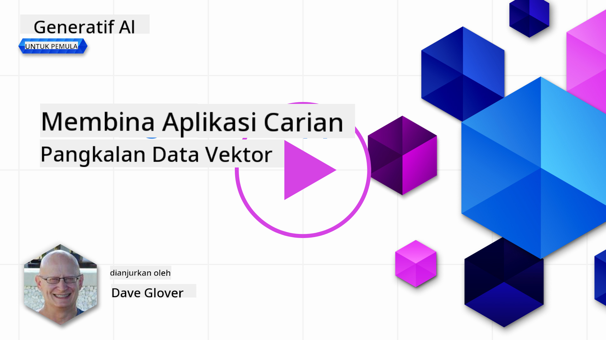
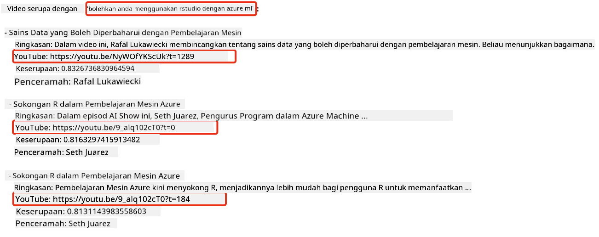
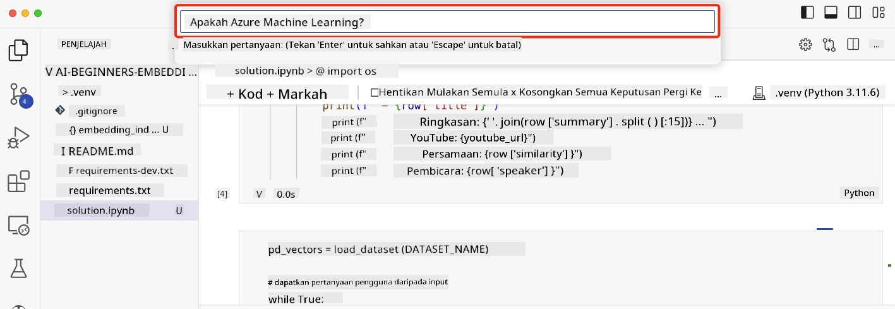

<!--
CO_OP_TRANSLATOR_METADATA:
{
  "original_hash": "d46aad0917a1a342d613e2c13d457da5",
  "translation_date": "2025-05-19T18:38:21+00:00",
  "source_file": "08-building-search-applications/README.md",
  "language_code": "ms"
}
-->
# Membangun Aplikasi Carian

[](https://aka.ms/gen-ai-lesson8-gh?WT.mc_id=academic-105485-koreyst)

> > _Klik gambar di atas untuk menonton video pelajaran ini_

LLM bukan sekadar chatbot dan penjanaan teks. Kita juga boleh membina aplikasi carian menggunakan Embeddings. Embeddings adalah representasi numerik data yang juga dikenali sebagai vektor, dan boleh digunakan untuk carian semantik data.

Dalam pelajaran ini, anda akan membina aplikasi carian untuk syarikat permulaan pendidikan kami. Syarikat permulaan kami adalah organisasi bukan untung yang menyediakan pendidikan percuma kepada pelajar di negara membangun. Syarikat permulaan kami mempunyai sejumlah besar video YouTube yang boleh digunakan oleh pelajar untuk belajar tentang AI. Syarikat permulaan kami mahu membina aplikasi carian yang membolehkan pelajar mencari video YouTube dengan menaip soalan.

Sebagai contoh, seorang pelajar mungkin menaip 'Apakah Jupyter Notebooks?' atau 'Apakah Azure ML' dan aplikasi carian akan memulangkan senarai video YouTube yang berkaitan dengan soalan tersebut, dan lebih baik lagi, aplikasi carian akan memulangkan pautan ke tempat dalam video di mana jawapan kepada soalan itu terletak.

## Pengenalan

Dalam pelajaran ini, kita akan meliputi:

- Carian Semantik vs Carian Kata Kunci.
- Apakah itu Text Embeddings.
- Mencipta Indeks Text Embeddings.
- Mencari dalam Indeks Text Embeddings.

## Matlamat Pembelajaran

Selepas menyelesaikan pelajaran ini, anda akan dapat:

- Membezakan antara carian semantik dan carian kata kunci.
- Menerangkan apa itu Text Embeddings.
- Mencipta aplikasi menggunakan Embeddings untuk mencari data.

## Mengapa membina aplikasi carian?

Mencipta aplikasi carian akan membantu anda memahami cara menggunakan Embeddings untuk mencari data. Anda juga akan belajar cara membina aplikasi carian yang boleh digunakan oleh pelajar untuk mencari maklumat dengan cepat.

Pelajaran ini termasuk Indeks Embedding transkrip YouTube untuk saluran YouTube Microsoft [AI Show](https://www.youtube.com/playlist?list=PLlrxD0HtieHi0mwteKBOfEeOYf0LJU4O1). AI Show adalah saluran YouTube yang mengajar anda tentang AI dan pembelajaran mesin. Indeks Embedding mengandungi Embeddings untuk setiap transkrip YouTube sehingga Oktober 2023. Anda akan menggunakan Indeks Embedding untuk membina aplikasi carian untuk syarikat permulaan kami. Aplikasi carian memulangkan pautan ke tempat dalam video di mana jawapan kepada soalan itu terletak. Ini adalah cara yang baik untuk pelajar mencari maklumat yang mereka perlukan dengan cepat.

Berikut adalah contoh pertanyaan semantik untuk soalan 'bolehkah anda menggunakan rstudio dengan azure ml?'. Lihatlah URL YouTube, anda akan melihat URL tersebut mengandungi cap masa yang membawa anda ke tempat dalam video di mana jawapan kepada soalan itu terletak.



## Apakah itu carian semantik?

Sekarang anda mungkin tertanya-tanya, apakah itu carian semantik? Carian semantik adalah teknik carian yang menggunakan semantik, atau makna, kata-kata dalam pertanyaan untuk memulangkan hasil yang relevan.

Berikut adalah contoh carian semantik. Katakan anda sedang mencari untuk membeli kereta, anda mungkin mencari 'kereta impian saya', carian semantik memahami bahawa anda tidak `dreaming` tentang kereta, tetapi sebaliknya anda sedang mencari untuk membeli kereta `ideal` anda. Carian semantik memahami niat anda dan memulangkan hasil yang relevan. Alternatifnya ialah `keyword search` yang secara literal akan mencari impian tentang kereta dan sering memulangkan hasil yang tidak relevan.

## Apakah itu Text Embeddings?

[Text embeddings](https://en.wikipedia.org/wiki/Word_embedding?WT.mc_id=academic-105485-koreyst) adalah teknik representasi teks yang digunakan dalam [pemprosesan bahasa semulajadi](https://en.wikipedia.org/wiki/Natural_language_processing?WT.mc_id=academic-105485-koreyst). Text embeddings adalah representasi numerik semantik teks. Embeddings digunakan untuk mewakili data dengan cara yang mudah difahami oleh mesin. Terdapat banyak model untuk membina text embeddings, dalam pelajaran ini, kita akan memberi tumpuan kepada menjana embeddings menggunakan Model Embedding OpenAI.

Berikut adalah contoh, bayangkan teks berikut adalah dalam transkrip dari salah satu episod di saluran YouTube AI Show:

```text
Today we are going to learn about Azure Machine Learning.
```

Kami akan menghantar teks kepada OpenAI Embedding API dan ia akan memulangkan embedding yang terdiri daripada 1536 nombor aka vektor. Setiap nombor dalam vektor mewakili aspek yang berbeza daripada teks. Untuk ringkasan, berikut adalah 10 nombor pertama dalam vektor.

```python
[-0.006655829958617687, 0.0026128944009542465, 0.008792596869170666, -0.02446001023054123, -0.008540431968867779, 0.022071078419685364, -0.010703742504119873, 0.003311325330287218, -0.011632772162556648, -0.02187200076878071, ...]
```

## Bagaimana Indeks Embedding dicipta?

Indeks Embedding untuk pelajaran ini dicipta dengan siri skrip Python. Anda akan menemui skrip bersama arahan dalam [README](./scripts/README.md?WT.mc_id=academic-105485-koreyst) dalam folder 'scripts' untuk pelajaran ini. Anda tidak perlu menjalankan skrip ini untuk menyelesaikan pelajaran ini kerana Indeks Embedding disediakan untuk anda.

Skrip melakukan operasi berikut:

1. Transkrip untuk setiap video YouTube dalam senarai main [AI Show](https://www.youtube.com/playlist?list=PLlrxD0HtieHi0mwteKBOfEeOYf0LJU4O1) dimuat turun.
2. Menggunakan [Fungsi OpenAI](https://learn.microsoft.com/azure/ai-services/openai/how-to/function-calling?WT.mc_id=academic-105485-koreyst), percubaan dibuat untuk mengekstrak nama penceramah dari 3 minit pertama transkrip YouTube. Nama penceramah untuk setiap video disimpan dalam Indeks Embedding yang dinamakan `embedding_index_3m.json`.
3. Teks transkrip kemudian dipecahkan kepada **segmen teks 3 minit**. Segmen termasuk kira-kira 20 perkataan bertindih dari segmen seterusnya untuk memastikan Embedding untuk segmen tidak terputus dan memberikan konteks carian yang lebih baik.
4. Setiap segmen teks kemudian dihantar kepada OpenAI Chat API untuk meringkaskan teks kepada 60 perkataan. Ringkasan juga disimpan dalam Indeks Embedding `embedding_index_3m.json`.
5. Akhirnya, teks segmen dihantar kepada OpenAI Embedding API. Embedding API memulangkan vektor 1536 nombor yang mewakili makna semantik segmen. Segmen bersama vektor Embedding OpenAI disimpan dalam Indeks Embedding `embedding_index_3m.json`.

### Pangkalan Data Vektor

Untuk kesederhanaan pelajaran, Indeks Embedding disimpan dalam fail JSON yang dinamakan `embedding_index_3m.json` dan dimuatkan ke dalam Pandas DataFrame. Walau bagaimanapun, dalam pengeluaran, Indeks Embedding akan disimpan dalam pangkalan data vektor seperti [Azure Cognitive Search](https://learn.microsoft.com/training/modules/improve-search-results-vector-search?WT.mc_id=academic-105485-koreyst), [Redis](https://cookbook.openai.com/examples/vector_databases/redis/readme?WT.mc_id=academic-105485-koreyst), [Pinecone](https://cookbook.openai.com/examples/vector_databases/pinecone/readme?WT.mc_id=academic-105485-koreyst), [Weaviate](https://cookbook.openai.com/examples/vector_databases/weaviate/readme?WT.mc_id=academic-105485-koreyst), dan lain-lain.

## Memahami kesamaan kosinus

Kita telah belajar tentang text embeddings, langkah seterusnya adalah belajar cara menggunakan text embeddings untuk mencari data dan khususnya mencari embeddings yang paling serupa dengan pertanyaan yang diberikan menggunakan kesamaan kosinus.

### Apakah itu kesamaan kosinus?

Kesamaan kosinus adalah ukuran kesamaan antara dua vektor, anda juga akan mendengar ini dirujuk sebagai `nearest neighbor search`. Untuk melakukan carian kesamaan kosinus, anda perlu _memvektor_ untuk teks _pertanyaan_ menggunakan OpenAI Embedding API. Kemudian hitung _kesamaan kosinus_ antara vektor pertanyaan dan setiap vektor dalam Indeks Embedding. Ingat, Indeks Embedding mempunyai vektor untuk setiap segmen teks transkrip YouTube. Akhirnya, urutkan hasil mengikut kesamaan kosinus dan segmen teks dengan kesamaan kosinus tertinggi adalah yang paling serupa dengan pertanyaan.

Dari perspektif matematik, kesamaan kosinus mengukur kosinus sudut antara dua vektor yang diproyeksikan dalam ruang multidimensi. Ukuran ini bermanfaat, kerana jika dua dokumen berjauhan dengan jarak Euclidean kerana saiz, mereka masih boleh mempunyai sudut yang lebih kecil antara mereka dan oleh itu kesamaan kosinus yang lebih tinggi. Untuk maklumat lanjut tentang persamaan kesamaan kosinus, lihat [Kesamaan kosinus](https://en.wikipedia.org/wiki/Cosine_similarity?WT.mc_id=academic-105485-koreyst).

## Membangun aplikasi carian pertama anda

Seterusnya, kita akan belajar cara membina aplikasi carian menggunakan Embeddings. Aplikasi carian akan membolehkan pelajar mencari video dengan menaip soalan. Aplikasi carian akan memulangkan senarai video yang berkaitan dengan soalan tersebut. Aplikasi carian juga akan memulangkan pautan ke tempat dalam video di mana jawapan kepada soalan itu terletak.

Penyelesaian ini dibina dan diuji pada Windows 11, macOS, dan Ubuntu 22.04 menggunakan Python 3.10 atau lebih baru. Anda boleh memuat turun Python dari [python.org](https://www.python.org/downloads/?WT.mc_id=academic-105485-koreyst).

## Tugasan - membina aplikasi carian, untuk membolehkan pelajar

Kami memperkenalkan syarikat permulaan kami pada permulaan pelajaran ini. Kini tiba masanya untuk membolehkan pelajar membina aplikasi carian untuk penilaian mereka.

Dalam tugasan ini, anda akan mencipta Perkhidmatan Azure OpenAI yang akan digunakan untuk membina aplikasi carian. Anda akan mencipta Perkhidmatan Azure OpenAI berikut. Anda memerlukan langganan Azure untuk menyelesaikan tugasan ini.

### Mulakan Azure Cloud Shell

1. Log masuk ke [portal Azure](https://portal.azure.com/?WT.mc_id=academic-105485-koreyst).
2. Pilih ikon Cloud Shell di sudut kanan atas portal Azure.
3. Pilih **Bash** untuk jenis persekitaran.

#### Cipta kumpulan sumber

> Untuk arahan ini, kami menggunakan kumpulan sumber bernama "semantic-video-search" di East US.
> Anda boleh menukar nama kumpulan sumber, tetapi apabila menukar lokasi untuk sumber,
> semak [jadual ketersediaan model](https://aka.ms/oai/models?WT.mc_id=academic-105485-koreyst).

```shell
az group create --name semantic-video-search --location eastus
```

#### Cipta sumber Perkhidmatan Azure OpenAI

Dari Azure Cloud Shell, jalankan perintah berikut untuk mencipta sumber Perkhidmatan Azure OpenAI.

```shell
az cognitiveservices account create --name semantic-video-openai --resource-group semantic-video-search \
    --location eastus --kind OpenAI --sku s0
```

#### Dapatkan titik akhir dan kunci untuk digunakan dalam aplikasi ini

Dari Azure Cloud Shell, jalankan perintah berikut untuk mendapatkan titik akhir dan kunci untuk sumber Perkhidmatan Azure OpenAI.

```shell
az cognitiveservices account show --name semantic-video-openai \
   --resource-group  semantic-video-search | jq -r .properties.endpoint
az cognitiveservices account keys list --name semantic-video-openai \
   --resource-group semantic-video-search | jq -r .key1
```

#### Terapkan model OpenAI Embedding

Dari Azure Cloud Shell, jalankan perintah berikut untuk menerapkan model OpenAI Embedding.

```shell
az cognitiveservices account deployment create \
    --name semantic-video-openai \
    --resource-group  semantic-video-search \
    --deployment-name text-embedding-ada-002 \
    --model-name text-embedding-ada-002 \
    --model-version "2"  \
    --model-format OpenAI \
    --sku-capacity 100 --sku-name "Standard"
```

## Penyelesaian

Buka [notebook penyelesaian](../../../08-building-search-applications/python/aoai-solution.ipynb) di GitHub Codespaces dan ikuti arahan dalam Jupyter Notebook.

Apabila anda menjalankan notebook, anda akan diminta untuk memasukkan pertanyaan. Kotak input akan kelihatan seperti ini:



## Kerja Bagus! Teruskan Pembelajaran Anda

Selepas menyelesaikan pelajaran ini, lihat koleksi Pembelajaran AI Generatif kami [Generative AI Learning collection](https://aka.ms/genai-collection?WT.mc_id=academic-105485-koreyst) untuk terus meningkatkan pengetahuan AI Generatif anda!

Pergi ke Pelajaran 9 di mana kita akan melihat bagaimana untuk [membina aplikasi penjanaan imej](../09-building-image-applications/README.md?WT.mc_id=academic-105485-koreyst)!

**Penafian**:  
Dokumen ini telah diterjemahkan menggunakan perkhidmatan terjemahan AI [Co-op Translator](https://github.com/Azure/co-op-translator). Walaupun kami berusaha untuk ketepatan, sila maklum bahawa terjemahan automatik mungkin mengandungi kesilapan atau ketidaktepatan. Dokumen asal dalam bahasa asalnya harus dianggap sebagai sumber berwibawa. Untuk maklumat penting, terjemahan manusia profesional disyorkan. Kami tidak bertanggungjawab atas sebarang salah faham atau salah tafsir yang timbul daripada penggunaan terjemahan ini.