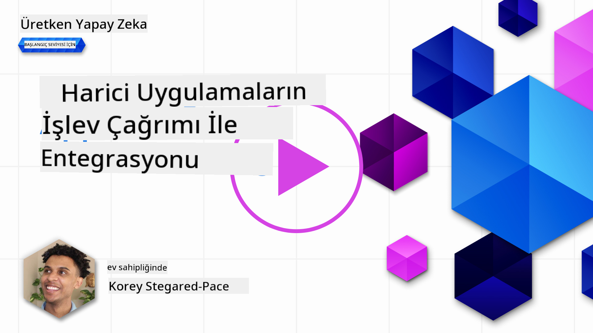
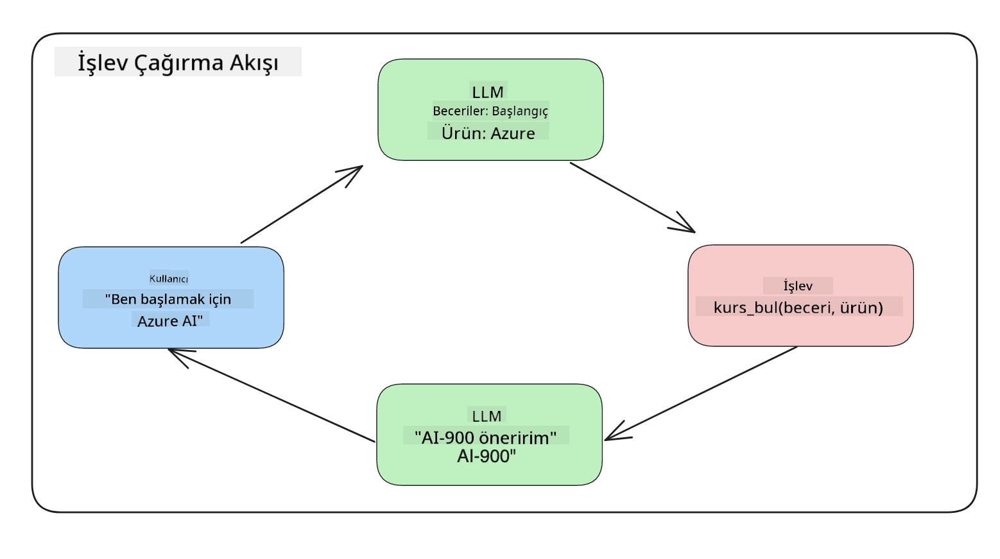
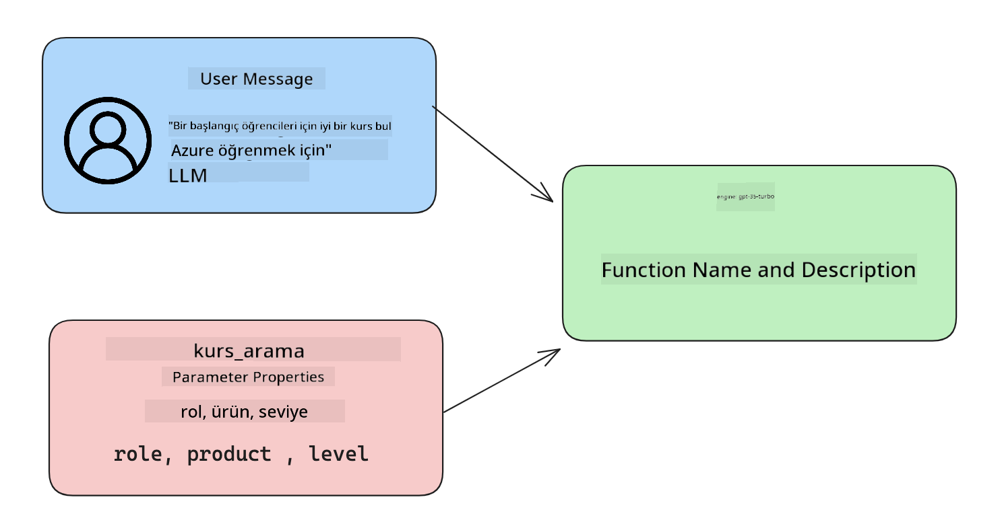

<!--
CO_OP_TRANSLATOR_METADATA:
{
  "original_hash": "77a48a201447be19aa7560706d6f93a0",
  "translation_date": "2025-05-19T21:28:48+00:00",
  "source_file": "11-integrating-with-function-calling/README.md",
  "language_code": "tr"
}
-->
# Fonksiyon çağrımı ile entegrasyon

[](https://aka.ms/gen-ai-lesson11-gh?WT.mc_id=academic-105485-koreyst)

Önceki derslerde oldukça fazla şey öğrendiniz. Ancak, daha fazla geliştirme yapabiliriz. Ele alabileceğimiz bazı konular, yanıtın aşağı akışta daha kolay çalışılabilmesi için nasıl daha tutarlı bir yanıt formatı elde edebileceğimizdir. Ayrıca, uygulamamızı daha da zenginleştirmek için diğer kaynaklardan veri eklemek isteyebiliriz.

Yukarıda belirtilen sorunlar, bu bölümde ele alınmak istenen konulardır.

## Giriş

Bu derste ele alınacak konular:

- Fonksiyon çağrımının ne olduğunu ve kullanım alanlarını açıklamak.
- Azure OpenAI kullanarak bir fonksiyon çağrımı oluşturmak.
- Bir uygulamaya fonksiyon çağrımını nasıl entegre edeceğinizi öğrenmek.

## Öğrenme Hedefleri

Bu dersin sonunda şunları yapabileceksiniz:

- Fonksiyon çağrımının kullanım amacını açıklamak.
- Azure OpenAI Hizmeti kullanarak Fonksiyon Çağrımı kurmak.
- Uygulamanızın kullanım durumu için etkili fonksiyon çağrıları tasarlamak.

## Senaryo: Sohbet botumuzu fonksiyonlarla geliştirmek

Bu ders için, kullanıcıların teknik kursları bulmak için bir sohbet botu kullanmalarına olanak tanıyan bir özellik oluşturmak istiyoruz. Kullanıcıların beceri seviyelerine, mevcut rollerine ve ilgi duydukları teknolojiye uygun kurslar önereceğiz.

Bu senaryoyu tamamlamak için şu kombinasyonu kullanacağız:

- Kullanıcı için bir sohbet deneyimi oluşturmak için `Azure OpenAI`.
- Kullanıcının isteğine göre kurs bulmasına yardımcı olmak için `Microsoft Learn Catalog API`.
- Kullanıcının sorgusunu alıp bir API isteği yapmak için bir fonksiyona göndermek için `Function Calling`.

Başlamak için, öncelikle neden fonksiyon çağrımını kullanmak isteyebileceğimize bakalım:

## Neden Fonksiyon Çağrımı

Fonksiyon çağrımından önce, bir LLM'den gelen yanıtlar yapılandırılmamış ve tutarsızdı. Geliştiriciler, her yanıt varyasyonunu ele alabilmek için karmaşık doğrulama kodları yazmak zorundaydı. Kullanıcılar "Stockholm'deki şu anki hava durumu nedir?" gibi cevaplar alamıyordu. Bunun nedeni, modellerin verilerin eğitildiği zamana kadar sınırlı olmasıydı.

Fonksiyon Çağrımı, Azure OpenAI Hizmeti'nin aşağıdaki sınırlamaları aşmak için sunduğu bir özelliktir:

- **Tutarlı yanıt formatı**. Yanıt formatını daha iyi kontrol edebilirsek, yanıtı diğer sistemlere daha kolay entegre edebiliriz.
- **Dış veri**. Bir uygulamanın diğer kaynaklarından verileri sohbet bağlamında kullanma yeteneği.

## Senaryo aracılığıyla problemi açıklamak

> Aşağıdaki senaryoyu çalıştırmak istiyorsanız, [dahil edilen not defterini](../../../11-integrating-with-function-calling/python/aoai-assignment.ipynb) kullanmanızı öneririz. Sorunu ele almak için fonksiyonların nasıl yardımcı olabileceğini açıklamaya çalışırken sadece okumak da mümkündür.

Yanıt formatı problemini açıklayan örneğe bakalım:

Diyelim ki öğrenci verilerinin bir veritabanını oluşturmak istiyoruz, böylece onlara doğru kursu önerebiliriz. Aşağıda, içerdiği veriler açısından çok benzer olan iki öğrenci açıklaması bulunmaktadır.

1. Azure OpenAI kaynağımıza bir bağlantı oluşturun:

   ```python
   import os
   import json
   from openai import AzureOpenAI
   from dotenv import load_dotenv
   load_dotenv()

   client = AzureOpenAI(
   api_key=os.environ['AZURE_OPENAI_API_KEY'],  # this is also the default, it can be omitted
   api_version = "2023-07-01-preview"
   )

   deployment=os.environ['AZURE_OPENAI_DEPLOYMENT']
   ```

   Aşağıda, `api_type`, `api_base`, `api_version` and `api_key`.

1. Creating two student descriptions using variables `student_1_description` and `student_2_description` ayarladığımız Azure OpenAI'ye bağlantımızı yapılandırmak için biraz Python kodu bulunmaktadır.

   ```python
   student_1_description="Emily Johnson is a sophomore majoring in computer science at Duke University. She has a 3.7 GPA. Emily is an active member of the university's Chess Club and Debate Team. She hopes to pursue a career in software engineering after graduating."

   student_2_description = "Michael Lee is a sophomore majoring in computer science at Stanford University. He has a 3.8 GPA. Michael is known for his programming skills and is an active member of the university's Robotics Club. He hopes to pursue a career in artificial intelligence after finishing his studies."
   ```

   Yukarıdaki öğrenci açıklamalarını verileri ayrıştırmak için bir LLM'ye göndermek istiyoruz. Bu veriler daha sonra uygulamamızda kullanılabilir ve bir API'ye gönderilebilir veya bir veritabanında saklanabilir.

1. İlgilendiğimiz bilgileri LLM'ye talimat verdiğimiz iki özdeş istem oluşturalım:

   ```python
   prompt1 = f'''
   Please extract the following information from the given text and return it as a JSON object:

   name
   major
   school
   grades
   club

   This is the body of text to extract the information from:
   {student_1_description}
   '''

   prompt2 = f'''
   Please extract the following information from the given text and return it as a JSON object:

   name
   major
   school
   grades
   club

   This is the body of text to extract the information from:
   {student_2_description}
   '''
   ```

   Yukarıdaki istemler, LLM'ye bilgileri çıkarmasını ve yanıtı JSON formatında döndürmesini talimat verir.

1. İstemleri ve Azure OpenAI ile bağlantıyı kurduktan sonra, `openai.ChatCompletion`. We store the prompt in the `messages` variable and assign the role to `user` kullanarak istemleri LLM'ye göndereceğiz. Bu, bir kullanıcının bir sohbet botuna yazdığı bir mesajı taklit etmek içindir.

   ```python
   # response from prompt one
   openai_response1 = client.chat.completions.create(
   model=deployment,
   messages = [{'role': 'user', 'content': prompt1}]
   )
   openai_response1.choices[0].message.content

   # response from prompt two
   openai_response2 = client.chat.completions.create(
   model=deployment,
   messages = [{'role': 'user', 'content': prompt2}]
   )
   openai_response2.choices[0].message.content
   ```

Şimdi her iki isteği de LLM'ye gönderebilir ve aldığımız yanıtı `openai_response1['choices'][0]['message']['content']`.

1. Lastly, we can convert the response to JSON format by calling `json.loads` gibi bulabiliriz:

   ```python
   # Loading the response as a JSON object
   json_response1 = json.loads(openai_response1.choices[0].message.content)
   json_response1
   ```

   Yanıt 1:

   ```json
   {
     "name": "Emily Johnson",
     "major": "computer science",
     "school": "Duke University",
     "grades": "3.7",
     "club": "Chess Club"
   }
   ```

   Yanıt 2:

   ```json
   {
     "name": "Michael Lee",
     "major": "computer science",
     "school": "Stanford University",
     "grades": "3.8 GPA",
     "club": "Robotics Club"
   }
   ```

   İstemler aynı ve açıklamalar benzer olmasına rağmen, `Grades` property formatted differently, as we can sometimes get the format `3.7` or `3.7 GPA` for example.

   This result is because the LLM takes unstructured data in the form of the written prompt and returns also unstructured data. We need to have a structured format so that we know what to expect when storing or using this data

So how do we solve the formatting problem then? By using functional calling, we can make sure that we receive structured data back. When using function calling, the LLM does not actually call or run any functions. Instead, we create a structure for the LLM to follow for its responses. We then use those structured responses to know what function to run in our applications.



We can then take what is returned from the function and send this back to the LLM. The LLM will then respond using natural language to answer the user's query.

## Use Cases for using function calls

There are many different use cases where function calls can improve your app like:

- **Calling External Tools**. Chatbots are great at providing answers to questions from users. By using function calling, the chatbots can use messages from users to complete certain tasks. For example, a student can ask the chatbot to "Send an email to my instructor saying I need more assistance with this subject". This can make a function call to `send_email(to: string, body: string)`

- **Create API or Database Queries**. Users can find information using natural language that gets converted into a formatted query or API request. An example of this could be a teacher who requests "Who are the students that completed the last assignment" which could call a function named `get_completed(student_name: string, assignment: int, current_status: string)`

- **Creating Structured Data**. Users can take a block of text or CSV and use the LLM to extract important information from it. For example, a student can convert a Wikipedia article about peace agreements to create AI flashcards. This can be done by using a function called `get_important_facts(agreement_name: string, date_signed: string, parties_involved: list)`

## Creating Your First Function Call

The process of creating a function call includes 3 main steps:

1. **Calling** the Chat Completions API with a list of your functions and a user message.
2. **Reading** the model's response to perform an action i.e. execute a function or API Call.
3. **Making** another call to Chat Completions API with the response from your function to use that information to create a response to the user.



### Step 1 - creating messages

The first step is to create a user message. This can be dynamically assigned by taking the value of a text input or you can assign a value here. If this is your first time working with the Chat Completions API, we need to define the `role` and the `content` of the message.

The `role` can be either `system` (creating rules), `assistant` (the model) or `user` (the end-user). For function calling, we will assign this as `user` ve bir örnek soru gibi değerler görüyoruz.

```python
messages= [ {"role": "user", "content": "Find me a good course for a beginner student to learn Azure."} ]
```

Farklı roller atanarak, LLM'ye bir şey söyleyenin sistem mi yoksa kullanıcı mı olduğu net bir şekilde belirtilir, bu da LLM'nin üzerine inşa edebileceği bir konuşma geçmişi oluşturmaya yardımcı olur.

### Adım 2 - fonksiyonlar oluşturmak

Sonra bir fonksiyon ve o fonksiyonun parametrelerini tanımlayacağız. Burada sadece `search_courses` but you can create multiple functions.

> **Important** : Functions are included in the system message to the LLM and will be included in the amount of available tokens you have available.

Below, we create the functions as an array of items. Each item is a function and has properties `name`, `description` and `parameters` adlı bir fonksiyon kullanacağız:

```python
functions = [
   {
      "name":"search_courses",
      "description":"Retrieves courses from the search index based on the parameters provided",
      "parameters":{
         "type":"object",
         "properties":{
            "role":{
               "type":"string",
               "description":"The role of the learner (i.e. developer, data scientist, student, etc.)"
            },
            "product":{
               "type":"string",
               "description":"The product that the lesson is covering (i.e. Azure, Power BI, etc.)"
            },
            "level":{
               "type":"string",
               "description":"The level of experience the learner has prior to taking the course (i.e. beginner, intermediate, advanced)"
            }
         },
         "required":[
            "role"
         ]
      }
   }
]
```

Her bir fonksiyon örneğini daha ayrıntılı olarak aşağıda açıklayalım:

- `name` - The name of the function that we want to have called.
- `description` - This is the description of how the function works. Here it's important to be specific and clear.
- `parameters` - A list of values and format that you want the model to produce in its response. The parameters array consists of items where the items have the following properties:
  1.  `type` - The data type of the properties will be stored in.
  1.  `properties` - List of the specific values that the model will use for its response
      1. `name` - The key is the name of the property that the model will use in its formatted response, for example, `product`.
      1. `type` - The data type of this property, for example, `string`.
      1. `description` - Description of the specific property.

There's also an optional property `required` - required property for the function call to be completed.

### Step 3 - Making the function call

After defining a function, we now need to include it in the call to the Chat Completion API. We do this by adding `functions` to the request. In this case `functions=functions`.

There is also an option to set `function_call` to `auto`. This means we will let the LLM decide which function should be called based on the user message rather than assigning it ourselves.

Here's some code below where we call `ChatCompletion.create`, note how we set `functions=functions` and `function_call="auto"` ve böylece LLM'ye sağladığımız fonksiyonları ne zaman çağıracağını seçme hakkı veriyoruz:

```python
response = client.chat.completions.create(model=deployment,
                                        messages=messages,
                                        functions=functions,
                                        function_call="auto")

print(response.choices[0].message)
```

Geri dönen yanıt şu şekilde görünüyor:

```json
{
  "role": "assistant",
  "function_call": {
    "name": "search_courses",
    "arguments": "{\n  \"role\": \"student\",\n  \"product\": \"Azure\",\n  \"level\": \"beginner\"\n}"
  }
}
```

Burada `search_courses` was called and with what arguments, as listed in the `arguments` property in the JSON response.

The conclusion the LLM was able to find the data to fit the arguments of the function as it was extracting it from the value provided to the `messages` parameter in the chat completion call. Below is a reminder of the `messages` değerini nasıl kullandığını görebiliyoruz:

```python
messages= [ {"role": "user", "content": "Find me a good course for a beginner student to learn Azure."} ]
```

Gördüğünüz gibi, `student`, `Azure` and `beginner` was extracted from `messages` and set as input to the function. Using functions this way is a great way to extract information from a prompt but also to provide structure to the LLM and have reusable functionality.

Next, we need to see how we can use this in our app.

## Integrating Function Calls into an Application

After we have tested the formatted response from the LLM, we can now integrate this into an application.

### Managing the flow

To integrate this into our application, let's take the following steps:

1. First, let's make the call to the OpenAI services and store the message in a variable called `response_message`.

   ```python
   response_message = response.choices[0].message
   ```

1. Şimdi Microsoft Learn API'sini çağırarak bir kurs listesi almak için fonksiyonu tanımlayacağız:

   ```python
   import requests

   def search_courses(role, product, level):
     url = "https://learn.microsoft.com/api/catalog/"
     params = {
        "role": role,
        "product": product,
        "level": level
     }
     response = requests.get(url, params=params)
     modules = response.json()["modules"]
     results = []
     for module in modules[:5]:
        title = module["title"]
        url = module["url"]
        results.append({"title": title, "url": url})
     return str(results)
   ```

   Artık `functions` variable. We're also making real external API calls to fetch the data we need. In this case, we go against the Microsoft Learn API to search for training modules.

Ok, so we created `functions` variables and a corresponding Python function, how do we tell the LLM how to map these two together so our Python function is called?

1. To see if we need to call a Python function, we need to look into the LLM response and see if `function_call` içinde yer alan ve belirtilen fonksiyonu çağıran bir Python fonksiyonu oluşturduğumuza dikkat edin. İşte aşağıda belirtilen kontrolü nasıl yapabileceğiniz:

   ```python
   # Check if the model wants to call a function
   if response_message.function_call.name:
    print("Recommended Function call:")
    print(response_message.function_call.name)
    print()

    # Call the function.
    function_name = response_message.function_call.name

    available_functions = {
            "search_courses": search_courses,
    }
    function_to_call = available_functions[function_name]

    function_args = json.loads(response_message.function_call.arguments)
    function_response = function_to_call(**function_args)

    print("Output of function call:")
    print(function_response)
    print(type(function_response))


    # Add the assistant response and function response to the messages
    messages.append( # adding assistant response to messages
        {
            "role": response_message.role,
            "function_call": {
                "name": function_name,
                "arguments": response_message.function_call.arguments,
            },
            "content": None
        }
    )
    messages.append( # adding function response to messages
        {
            "role": "function",
            "name": function_name,
            "content":function_response,
        }
    )
   ```

   Bu üç satır, fonksiyon adını, argümanları çıkarmamızı ve çağrıyı yapmamızı sağlar:

   ```python
   function_to_call = available_functions[function_name]

   function_args = json.loads(response_message.function_call.arguments)
   function_response = function_to_call(**function_args)
   ```

   Kodumuzu çalıştırdıktan sonra çıkan sonuç aşağıdadır:

   **Çıktı**

   ```Recommended Function call:
   {
     "name": "search_courses",
     "arguments": "{\n  \"role\": \"student\",\n  \"product\": \"Azure\",\n  \"level\": \"beginner\"\n}"
   }

   Output of function call:
   [{'title': 'Describe concepts of cryptography', 'url': 'https://learn.microsoft.com/training/modules/describe-concepts-of-cryptography/?
   WT.mc_id=api_CatalogApi'}, {'title': 'Introduction to audio classification with TensorFlow', 'url': 'https://learn.microsoft.com/en-
   us/training/modules/intro-audio-classification-tensorflow/?WT.mc_id=api_CatalogApi'}, {'title': 'Design a Performant Data Model in Azure SQL
   Database with Azure Data Studio', 'url': 'https://learn.microsoft.com/training/modules/design-a-data-model-with-ads/?
   WT.mc_id=api_CatalogApi'}, {'title': 'Getting started with the Microsoft Cloud Adoption Framework for Azure', 'url':
   'https://learn.microsoft.com/training/modules/cloud-adoption-framework-getting-started/?WT.mc_id=api_CatalogApi'}, {'title': 'Set up the
   Rust development environment', 'url': 'https://learn.microsoft.com/training/modules/rust-set-up-environment/?WT.mc_id=api_CatalogApi'}]
   <class 'str'>
   ```

1. Şimdi güncellenmiş mesajı `messages` LLM'ye göndereceğiz, böylece API JSON formatında bir yanıt yerine doğal dilde bir yanıt alabiliriz.

   ```python
   print("Messages in next request:")
   print(messages)
   print()

   second_response = client.chat.completions.create(
      messages=messages,
      model=deployment,
      function_call="auto",
      functions=functions,
      temperature=0
         )  # get a new response from GPT where it can see the function response


   print(second_response.choices[0].message)
   ```

   **Çıktı**

   ```python
   {
     "role": "assistant",
     "content": "I found some good courses for beginner students to learn Azure:\n\n1. [Describe concepts of cryptography] (https://learn.microsoft.com/training/modules/describe-concepts-of-cryptography/?WT.mc_id=api_CatalogApi)\n2. [Introduction to audio classification with TensorFlow](https://learn.microsoft.com/training/modules/intro-audio-classification-tensorflow/?WT.mc_id=api_CatalogApi)\n3. [Design a Performant Data Model in Azure SQL Database with Azure Data Studio](https://learn.microsoft.com/training/modules/design-a-data-model-with-ads/?WT.mc_id=api_CatalogApi)\n4. [Getting started with the Microsoft Cloud Adoption Framework for Azure](https://learn.microsoft.com/training/modules/cloud-adoption-framework-getting-started/?WT.mc_id=api_CatalogApi)\n5. [Set up the Rust development environment](https://learn.microsoft.com/training/modules/rust-set-up-environment/?WT.mc_id=api_CatalogApi)\n\nYou can click on the links to access the courses."
   }

   ```

## Ödev

Azure OpenAI Fonksiyon Çağrımı öğreniminizi sürdürmek için şunları yapabilirsiniz:

- Öğrencilerin daha fazla kurs bulmasına yardımcı olabilecek daha fazla fonksiyon parametresi.
- Öğrencinin ana dili gibi daha fazla bilgi alan başka bir fonksiyon çağrısı oluşturun.
- Fonksiyon çağrısı ve/veya API çağrısı uygun kurslar döndürmediğinde hata işleme oluşturun.

İpucu: Bu verilerin nasıl ve nerede mevcut olduğunu görmek için [Learn API referans belgeleri](https://learn.microsoft.com/training/support/catalog-api-developer-reference?WT.mc_id=academic-105485-koreyst) sayfasını takip edin.

## Harika İş! Yolculuğa Devam Edin

Bu dersi tamamladıktan sonra, Generative AI bilginizi artırmak için [Generative AI Öğrenme koleksiyonumuzu](https://aka.ms/genai-collection?WT.mc_id=academic-105485-koreyst) inceleyin!

AI uygulamaları için nasıl [UX tasarlayacağımızı](../12-designing-ux-for-ai-applications/README.md?WT.mc_id=academic-105485-koreyst) inceleyeceğimiz 12. Derse geçin!

**Feragatname**: 
Bu belge, AI çeviri hizmeti [Co-op Translator](https://github.com/Azure/co-op-translator) kullanılarak çevrilmiştir. Doğruluk için çaba göstersek de, otomatik çevirilerin hata veya yanlışlık içerebileceğini lütfen unutmayın. Orijinal belge, kendi dilinde yetkili kaynak olarak kabul edilmelidir. Kritik bilgiler için profesyonel insan çevirisi önerilir. Bu çevirinin kullanımından kaynaklanan yanlış anlamalar veya yanlış yorumlamalardan sorumlu değiliz.