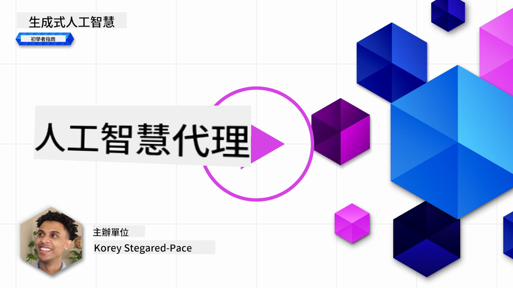
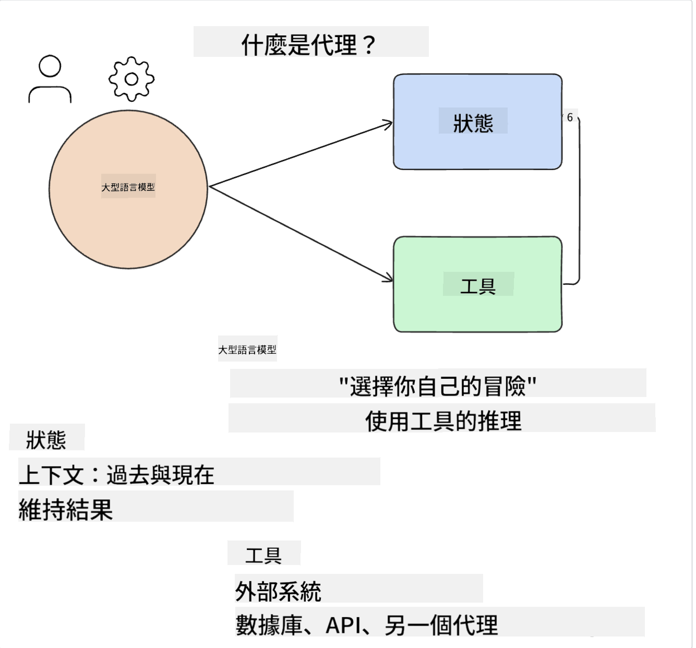
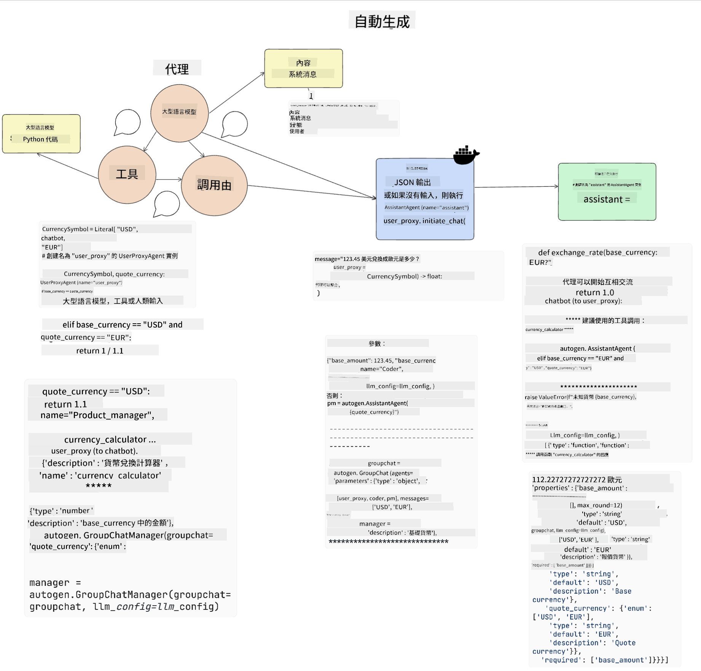
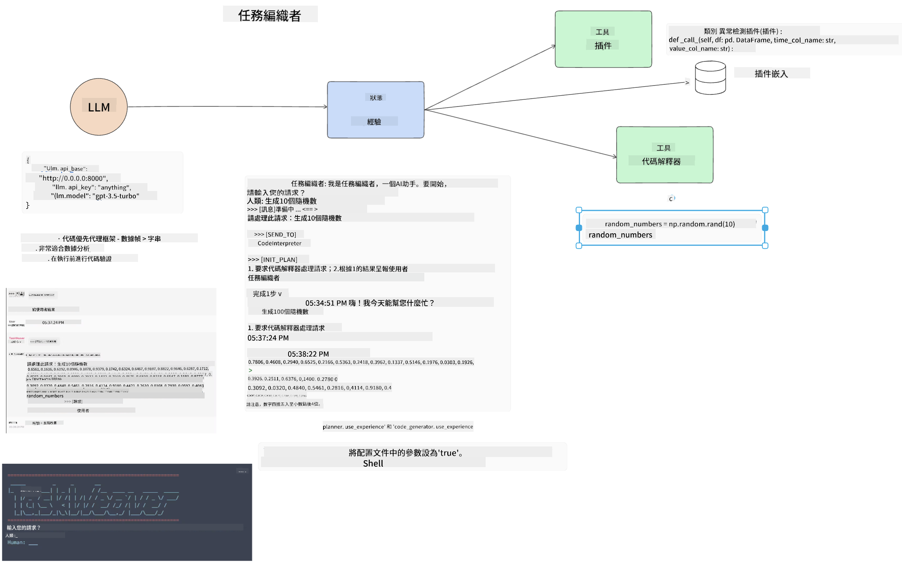
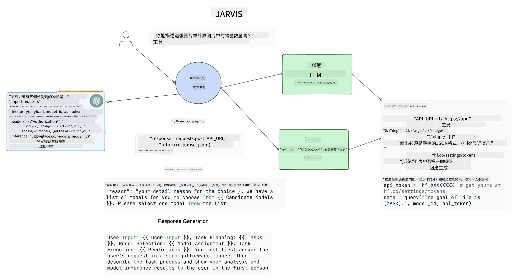

<!--
CO_OP_TRANSLATOR_METADATA:
{
  "original_hash": "11f03c81f190d9cbafd0f977dcbede6c",
  "translation_date": "2025-05-20T07:11:13+00:00",
  "source_file": "17-ai-agents/README.md",
  "language_code": "tw"
}
-->
[](https://aka.ms/gen-ai-lesson17-gh?WT.mc_id=academic-105485-koreyst)

## 介紹

AI Agent 是生成式 AI 的一個令人興奮的發展，它讓大型語言模型（LLMs）從助手演變成能夠採取行動的代理。AI Agent 框架使開發者能夠創建應用程式，讓 LLMs 獲得工具和狀態管理的權限。這些框架也增強了可見性，讓用戶和開發者可以監控 LLMs 所計劃的行動，從而改善體驗管理。

本課程將涵蓋以下領域：

- 理解什麼是 AI Agent - AI Agent 到底是什麼？
- 探索四種不同的 AI Agent 框架 - 它們有什麼獨特之處？
- 將這些 AI Agent 應用於不同的使用案例 - 什麼時候應該使用 AI Agent？

## 學習目標

完成本課程後，您將能夠：

- 解釋什麼是 AI Agent 以及它們如何被使用。
- 理解一些流行的 AI Agent 框架之間的差異，以及它們的不同之處。
- 理解 AI Agent 的運作方式，以便用於構建應用程式。

## 什麼是 AI Agent？

AI Agent 是生成式 AI 世界中一個非常令人興奮的領域。隨著這種興奮，有時會出現術語和應用的混淆。為了簡化並涵蓋大多數提到 AI Agent 的工具，我們將使用以下定義：

AI Agent 允許大型語言模型（LLMs）透過提供 **狀態** 和 **工具** 來執行任務。



讓我們來定義這些術語：

**大型語言模型** - 這些是本課程中提到的模型，例如 GPT-3.5、GPT-4、Llama-2 等。

**狀態** - 這指的是 LLM 工作的上下文。LLM 使用其過去行動的上下文和當前上下文，引導其決策進行後續行動。AI Agent 框架使開發者能夠更輕鬆地維持這種上下文。

**工具** - 為了完成用戶請求的任務以及 LLM 所計劃的任務，LLM 需要訪問工具。工具的一些例子可以是數據庫、API、外部應用程式，甚至是另一個 LLM！

這些定義希望能為您提供良好的基礎，讓我們接下來探討它們的實施方式。我們來探索一些不同的 AI Agent 框架：

## LangChain Agents

[LangChain Agents](https://python.langchain.com/docs/how_to/#agents?WT.mc_id=academic-105485-koreyst) 是我們提供的定義的一種實施。

為了管理 **狀態**，它使用了一個內建函數 `AgentExecutor`。這個函數接受已定義的 `agent` 和可用的 `tools`。

`Agent Executor` 也會儲存聊天記錄，以提供聊天的上下文。


LangChain 提供了一個 [工具目錄](https://integrations.langchain.com/tools?WT.mc_id=academic-105485-koreyst)，這些工具可以導入到您的應用程式中，讓 LLM 可以訪問。這些工具是由社群和 LangChain 團隊製作的。

然後，您可以定義這些工具並將它們傳遞給 `Agent Executor`。

可見性是談論 AI Agent 時的另一個重要方面。對於應用程式開發者來說，了解 LLM 使用了哪個工具以及為什麼是很重要的。為此，LangChain 團隊開發了 LangSmith。

## AutoGen

接下來我們將討論的 AI Agent 框架是 [AutoGen](https://microsoft.github.io/autogen/?WT.mc_id=academic-105485-koreyst)。AutoGen 的主要焦點是對話。代理既是 **可對話的** 又是 **可自定義的**。

**可對話的 -** LLMs 可以啟動並繼續與另一個 LLM 的對話，以完成任務。這是通過創建 `AssistantAgents` 並給予它們特定的系統消息來完成的。

```python

autogen.AssistantAgent( name="Coder", llm_config=llm_config, ) pm = autogen.AssistantAgent( name="Product_manager", system_message="Creative in software product ideas.", llm_config=llm_config, )

```

**可自定義的** - 代理不僅可以定義為 LLMs，還可以是用戶或工具。作為開發者，您可以定義一個 `UserProxyAgent`，負責與用戶互動以獲取反饋來完成任務。這種反饋可以繼續執行任務或停止它。

```python
user_proxy = UserProxyAgent(name="user_proxy")
```

### 狀態和工具

為了改變和管理狀態，助手代理生成 Python 代碼以完成任務。

以下是該過程的示例：



#### 使用系統消息定義的 LLM

```python
system_message="For weather related tasks, only use the functions you have been provided with. Reply TERMINATE when the task is done."
```

這些系統消息指導這個特定的 LLM 哪些功能與其任務相關。請記住，使用 AutoGen 您可以有多個定義的 AssistantAgents，每個都有不同的系統消息。

#### 用戶啟動聊天

```python
user_proxy.initiate_chat( chatbot, message="I am planning a trip to NYC next week, can you help me pick out what to wear? ", )

```

這個來自 user_proxy（人類）的消息將啟動代理探索應執行的可能功能的過程。

#### 執行功能

```bash
chatbot (to user_proxy):

***** Suggested tool Call: get_weather ***** Arguments: {"location":"New York City, NY","time_periond:"7","temperature_unit":"Celsius"} ******************************************************** --------------------------------------------------------------------------------

>>>>>>>> EXECUTING FUNCTION get_weather... user_proxy (to chatbot): ***** Response from calling function "get_weather" ***** 112.22727272727272 EUR ****************************************************************

```

一旦初始聊天被處理，代理將發送建議的工具來調用。在這種情況下，它是一個名為 `get_weather`. Depending on your configuration, this function can be automatically executed and read by the Agent or can be executed based on user input.

You can find a list of [AutoGen code samples](https://microsoft.github.io/autogen/docs/Examples/?WT.mc_id=academic-105485-koreyst) to further explore how to get started building.

## Taskweaver

The next agent framework we will explore is [Taskweaver](https://microsoft.github.io/TaskWeaver/?WT.mc_id=academic-105485-koreyst). It is known as a "code-first" agent because instead of working strictly with `strings` , it can work with DataFrames in Python. This becomes extremely useful for data analysis and generation tasks. This can be things like creating graphs and charts or generating random numbers.

### State and Tools

To manage the state of the conversation, TaskWeaver uses the concept of a `Planner`. The `Planner` is a LLM that takes the request from the users and maps out the tasks that need to be completed to fulfill this request.

To complete the tasks the `Planner` is exposed to the collection of tools called `Plugins` 的功能。這可以是 Python 類或一般的代碼解釋器。這些插件被儲存為嵌入，以便 LLM 可以更好地搜索正確的插件。



以下是一個處理異常檢測的插件示例：

```python
class AnomalyDetectionPlugin(Plugin): def __call__(self, df: pd.DataFrame, time_col_name: str, value_col_name: str):
```

在執行之前會驗證代碼。Taskweaver 中管理上下文的另一個功能是 `experience`. Experience allows for the context of a conversation to be stored over to the long term in a YAML file. This can be configured so that the LLM improves over time on certain tasks given that it is exposed to prior conversations.

## JARVIS

The last agent framework we will explore is [JARVIS](https://github.com/microsoft/JARVIS?tab=readme-ov-file?WT.mc_id=academic-105485-koreyst). What makes JARVIS unique is that it uses an LLM to manage the `state` 的對話和 `tools` 是其他 AI 模型。每個 AI 模型都是專門的模型，執行某些任務，如物體檢測、轉錄或圖像字幕。



LLM 作為一個通用模型，接收用戶的請求並識別具體任務以及完成任務所需的任何參數/數據。

```python
[{"task": "object-detection", "id": 0, "dep": [-1], "args": {"image": "e1.jpg" }}]
```

然後，LLM 以專門的 AI 模型可以解釋的方式格式化請求，例如 JSON。一旦 AI 模型根據任務返回其預測，LLM 接收響應。

如果需要多個模型來完成任務，它還會在將它們整合起來生成用戶響應之前解釋這些模型的響應。

下面的示例顯示了當用戶請求圖像中物體的描述和數量時，這將如何運作：

## 作業

為了繼續學習 AI Agent，您可以使用 AutoGen 構建：

- 一個模擬教育初創公司不同部門業務會議的應用程式。
- 創建系統消息，指導 LLM 理解不同的人物角色和優先事項，並使用戶能夠推銷新的產品理念。
- 然後，LLM 應生成來自每個部門的後續問題，以完善和改進推銷和產品理念。

## 學習不止於此，繼續您的旅程

完成本課程後，查看我們的 [生成式 AI 學習集合](https://aka.ms/genai-collection?WT.mc_id=academic-105485-koreyst)，繼續提升您的生成式 AI 知識！

**免責聲明**：
本文檔使用AI翻譯服務[Co-op Translator](https://github.com/Azure/co-op-translator)進行翻譯。儘管我們努力追求準確性，但請注意自動翻譯可能包含錯誤或不準確之處。應將原始語言的文檔視為權威來源。對於關鍵信息，建議使用專業人工翻譯。我們不對使用此翻譯引起的任何誤解或錯誤負責。